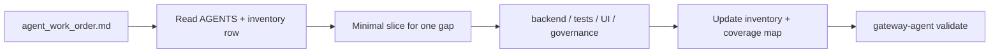

# Gateway Platform — Competitor SDLC Implementation

This repo is **TARGET_REPO**. The orchestrator lives in sibling checkout **gateway-enhancement-agent**.

## Before any change

1. Read [backend/AGENTS.md](backend/AGENTS.md)
2. Read [backend/docs/governance/api-inventory-and-ui-map.md](backend/docs/governance/api-inventory-and-ui-map.md)
3. Open the active work order: `../gateway-enhancement-agent/artifacts/cycle-*/agent_work_order.md`  
   (LaunchAgent path: `~/Library/Application Support/gateway-enhancement-agent/artifacts/cycle-*/`)

Orchestrator workflow (cycles, parallel workers, competitive discovery):  
[`../gateway-enhancement-agent/.cursor/skills/gateway-competitor-sdlc/SKILL.md`](../gateway-enhancement-agent/.cursor/skills/gateway-competitor-sdlc/SKILL.md)

## Work order workflow



1. Parse gap ID, route, coverage, and `source` from the work order
2. Implement only the slice needed for that gap (one route or one capability)
3. Update governance when coverage changes
4. Run validation from the agent repo (not this repo's pytest alone for agent cycles)

## Gap types (implemented)

| Source | ID prefix | What to implement |
|--------|-----------|-------------------|
| API inventory | `inv-*` Partial | UI + governance (backend often done) |
| API inventory | `inv-*` Gap | Backend router + tests + governance |
| Competitor research | `cmp-*` no route | Governance / parity docs only |
| Competitor research | `cmp-*` with route | Same as inventory Gap |
| Optimization theme | `opt-*` | Only if agent has `allow_optimization_themes: true` |
| Security audit | `sec-*` | Backend tests + risk register; optional router fix if route is Gap |

For `sec-*` work orders: add deny-path pytest and update `backend/docs/security/residual-and-accepted-risk-register.md`. Review stage is never skipped. Also follow [backend/AGENTS.md](backend/AGENTS.md) role lenses.

## UI console priority (when work order touches UI)

Per [AGENTS.md](AGENTS.md):

1. Playground
2. Benchmark and Scan
3. Routing and Gateway
4. Route Drafts
5. Compliance

Add nav entry + view section; match control-center patterns in [frontend/README.md](frontend/README.md).

## Patch rules

- Use **SEARCH/REPLACE** hunks for `frontend/app.js`, large HTML partials, governance tables
- **Do not** rewrite `backend/app/routers/gateway.py` or `frontend/app.js` wholesale
- Vector-store routes → `backend/app/routers/gateway_rag.py`
- Preserve security contract: roles, audit, least privilege, production dual-approval

## Checklist

```
- [ ] Read design_brief.md + gap snapshot in work order
- [ ] Minimal slice for one inv-* or cmp-* gap
- [ ] backend/tests/test_gateway_*.py if route changed
- [ ] api-inventory-and-ui-map.md if endpoint/UI status changed
- [ ] ui-api-design-coverage-map.md if UI changed
- [ ] doc_sync_checklist.md from cycle artifacts
- [ ] gateway-agent validate passes (both tiers)
```

## Validate

From **gateway-enhancement-agent** checkout:

```bash
cd "../gateway-enhancement-agent"
TARGET_REPO="$(pwd)/../new design" gateway-agent validate
```

Local checks in this repo (also run by agent gates):

```bash
node --check frontend/app.js
cd backend && python3 -m pytest -q tests/test_gateway_inference.py tests/test_gateway_fine_tuning.py tests/test_gateway_assistants.py
bash frontend/scripts/security_smoke.sh
```

### Governance-only skip (agent validation)

When **all** changed files are under `backend/docs/governance/`:

- Agent skips `gateway_pytest` and `control_coverage`
- Frontend gates skip if no `frontend/` files in the diff

Mixed governance + code changes run full gates.

## Primary sources of truth

See [AGENTS.md](AGENTS.md) — Primary Sources of Truth section.

## Reference

Env vars, artifact paths, troubleshooting: [reference.md](reference.md) and [`../gateway-enhancement-agent/.cursor/skills/gateway-competitor-sdlc/reference.md`](../gateway-enhancement-agent/.cursor/skills/gateway-competitor-sdlc/reference.md).
