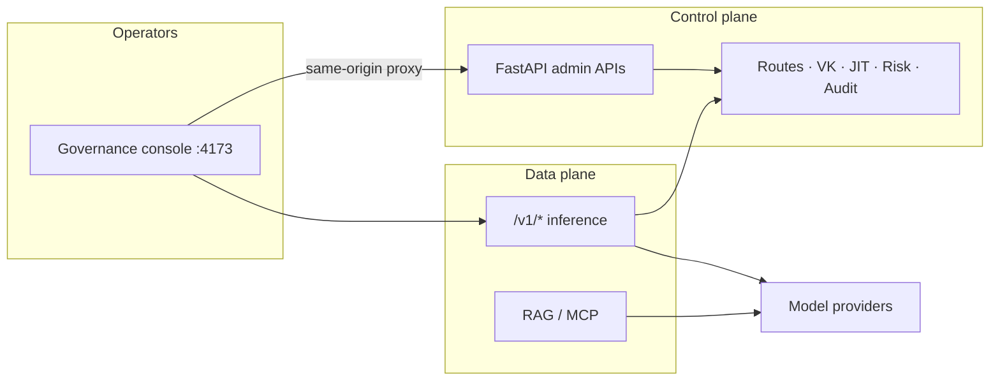

# AgentHub

**Governed AI gateway and control plane** for routing, budgets, virtual keys, Flow Studio workflows, and operator evidence — OpenAI-compatible inference with institutional guardrails.

[](https://github.com/shashankcse1/Agenthub/actions/workflows/backend-ci.yml)
[](./LICENSE)
[](./CONTRIBUTING.md)
[](./CHANGELOG.md)

> AgentHub is an **inference / AI gateway control plane**. It coexists with enterprise identity tools; it does **not** crawl SaaS OAuth estates or replace full IGA/ISPM products.

## Contents

- [Who this is for](#who-this-is-for)
- [Why AgentHub](#why-agenthub)
- [Architecture at a glance](#architecture-at-a-glance)
- [Quick start (local)](#quick-start-local)
- [Explore the console](#explore-the-console)
- [Repository map](#repository-map)
- [SDKs](#sdks)
- [Contributing](#contributing)
- [Community health](#community-health)
- [License](#license)

## Who this is for

| Audience | Start here |
| -------- | ---------- |
| Operator / platform engineer | [Quick start](#quick-start-local) → [docs/EXPLORING.md](./docs/EXPLORING.md) |
| Contributor | [CONTRIBUTING.md](./CONTRIBUTING.md) → [docs/GOOD_FIRST_ISSUES.md](./docs/GOOD_FIRST_ISSUES.md) |
| Security reviewer | [SECURITY.md](./SECURITY.md) → [residual risk register](./backend/docs/security/residual-and-accepted-risk-register.md) |
| Architect | [architecture-document.md](./architecture-document.md) §0 → [product completion](./backend/docs/governance/product-completion-status.md) |

Vocabulary: [docs/GLOSSARY.md](./docs/GLOSSARY.md)

## Why AgentHub

| You get | Instead of |
|---------|------------|
| One operator plane for routes, keys, JIT, cost, audit, Flow Studio | Spreadsheet + ad-hoc proxy configs |
| OpenAI-compatible `/v1/*` with policy, risk, and dual-approval rails | Ungoverned direct provider calls |
| Same-origin local console with session cookies + CSRF | Fragile cross-origin demo logins |
| Explicit non-goals and honesty gates for leadership claims | Overstated “fully secure / #1” marketing |

## Architecture at a glance



Locally, `APP_PLANE=all` runs control + data together. Production can split planes (`plane-split` compose) — see [plane-split-runbook.md](./backend/docs/governance/plane-split-runbook.md).

## Quick start (local)

**Prereqs:** Docker (PostgreSQL), Python 3.11+, Node not required for the static UI.

```bash
# From repo root
./scripts/startlocal_detached.sh
```

1. Open **http://127.0.0.1:4173/login.html**
2. Keep **API Base** as `http://127.0.0.1:4173` (same-origin UI→API proxy)
3. Sign in with the Day-0 `admin` user (see [Day-0 hardening](./backend/docs/security/day0-password-and-secrets-hardening.md); on macOS the password may be in Keychain service `agenthub.day0.admin`)

Health checks:

```bash
curl -sS http://127.0.0.1:4173/health | head -c 200
curl -sS http://127.0.0.1:8000/health | head -c 200
```

**Next:** take the [30-minute Exploring tour](./docs/EXPLORING.md). Coverage gates: [docs/COVERAGE.md](./docs/COVERAGE.md) (`make coverage-critical` ≥99% on auth spine).

More runbooks: [operations-quickstart.md](./operations-quickstart.md) · [frontend/README.md](./frontend/README.md) · [DEPLOYMENT.md](./DEPLOYMENT.md)

<!-- Screenshot welcome: add docs/assets/overview.png and uncomment

-->

## Explore the console

Priority operator surfaces (nav order):

1. **Playground** — governed prompts and runs  
2. **Benchmark & Scan** — evaluation history  
3. **Routing & Gateway** — routes, keys, JIT, NHI, runtime risk, Cursor gateway ops  
4. **Flow Studio** — design → govern → run multi-step workflows  
5. **Compliance / Observability / Cost** — evidence and spend  

## Repository map

```text
backend/     FastAPI control + data plane, tests, governance docs
frontend/    Operator console (static UI + same-origin API proxy)
sdk/         Python + JS helpers
extensions/  GuardBridge browser extension scaffolds
scripts/     Local/prod stack helpers
docs/        Explorer tour, glossary, good-first issues, maintainer checklist
blog/        Program / “governed velocity” narrative packs (optional reading)
```

Canonical status & design:

- [Product completion status](./backend/docs/governance/product-completion-status.md)
- [Architecture](./architecture-document.md)
- [API inventory & UI map](./backend/docs/governance/api-inventory-and-ui-map.md)
- [Coverage map](./backend/docs/governance/ui-api-design-coverage-map.md)
- [Documentation source of truth](./backend/docs/governance/documentation-source-of-truth.md)
- [Changelog](./CHANGELOG.md)
- [Agent delivery guide](./AGENTS.md) (for coding agents; humans start here at the README)

## SDKs

- Python: [`sdk/python`](./sdk/python)
- JavaScript: [`sdk/js`](./sdk/js)
- Publish notes: [`sdk/PUBLISH.md`](./sdk/PUBLISH.md)

## Contributing

We want this project to mature with community help — docs, tests, UI polish, and carefully scoped gateway features.

1. Read **[CONTRIBUTING.md](./CONTRIBUTING.md)**  
2. Pick a task from **[docs/GOOD_FIRST_ISSUES.md](./docs/GOOD_FIRST_ISSUES.md)**  
3. Open a PR using the template  

Security reports: **[SECURITY.md](./SECURITY.md)** (private reporting preferred).  
Privileged paths must follow [backend/AGENTS.md](./backend/AGENTS.md).

Maintainers: [docs/MAINTAINER_CHECKLIST.md](./docs/MAINTAINER_CHECKLIST.md) · seed issues with `./scripts/seed_good_first_issues.sh` (after `gh auth login`).

## Community health

| Resource | File |
| -------- | ---- |
| README | [README.md](./README.md) (this file) |
| Code of conduct | [CODE_OF_CONDUCT.md](./CODE_OF_CONDUCT.md) |
| Contributing guidelines | [CONTRIBUTING.md](./CONTRIBUTING.md) |
| License | [LICENSE](./LICENSE) (Apache-2.0) |
| Security policy | [SECURITY.md](./SECURITY.md) |
| Issue templates | [`.github/ISSUE_TEMPLATE/`](./.github/ISSUE_TEMPLATE/) |
| Pull request template | [`.github/PULL_REQUEST_TEMPLATE.md`](./.github/PULL_REQUEST_TEMPLATE.md) |

### Visibility tips

1. ⭐ Star the repo and pin it on your profile  
2. Add GitHub **Topics** + enable **Discussions**  
3. File bugs with the Bug report template (ports, API Base, role)  
4. Share a short demo of Flow Studio or Routing & Gateway  

## License

Apache License 2.0 — see [LICENSE](./LICENSE) and [NOTICE](./NOTICE).

## Disclaimer

This software is provided as-is for operators and builders. Do **not** treat any build as “fully secure” or free of residual risk. See the [residual and accepted risk register](./backend/docs/security/residual-and-accepted-risk-register.md).
