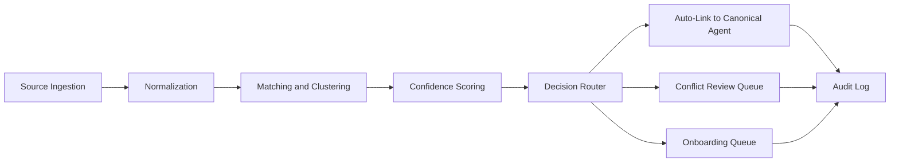

# Architecture Document

Date: 2026-06-09
System: Enterprise Multi-Agent Platform

## 0. Recent Delivery Sync (2026-06-12)

1. Frontend clean-architecture component slice:
- Shared JS modules (`constants`, `api-client`, `api-cache`, `ui-coverage`, `platform-status`, `operator-feedback`) load before `app.js`; Gap gating, boot GET dedupe, operational banners, and feedback capture are componentized without a build step.
- Lazy view loading via `view-loader.js` hydrates only `overview` at boot; other consoles load on first navigation.

2. Governance and platform operator experience:
- `GET /governance/ui-coverage*` reports backend-vs-frontend gaps; `GET /platform/operational-status` and `/platform/feedback*` support maintenance/slow/downtime banners and operator feedback analytics with triage actions.
- Domain constants (`backend/app/domain_constants.py`) and runtime-config keys centralize discovery, observability, and platform UX thresholds.

3. Runtime config cache observability:
- `GET /health` exposes `runtime_config_cache` posture for cloud operators without leaking secret values.

4. Discovery operator UX:
- Source topology uses horizontal-scroll layout with clickable nodes; agent-ops trace sources use functional labels and Observability pivot from Discovery.

## 0.1 Prior Delivery Sync (2026-06-10)

The architecture baseline now includes these delivered governance-depth capabilities:

1. Realtime/media transport governance depth in gateway compatibility layer:
- Inline-binary stream policy controls now include event-type allowlists, dedicated inline byte caps, and optional correlation-id requirements, enforced at realtime session ingest.
- Existing production dual-approval semantics for inline binary operations remain mandatory.

2. Prompt and quality operations governance depth:
- Prompt promotion now includes stricter release discipline and validation workflow depth.
- Quality triage and escalation lifecycle controls include operator-grade queueing, SLA-based progression, and auditable notification handoff metadata.

3. Model catalog governance depth:
- Supported-model catalog now includes recommendation explainability metadata plus approval/version progression controls suitable for CISO and security-architecture review.

4. External observability sink productization:
- Gateway external callbacks now support sink-specific routing metadata and correlation preset policy controls for downstream audit and incident triage workflows.

## 1. Architectural Goals

1. Identity-first agent platform
2. Strong ownership governance
3. Multi-source discovery and canonical inventory
4. Secure, policy-enforced runtime
5. Reliable long-horizon execution
6. Full observability and auditable operations
7. Real-time cost evaluation and budget-aware control loops
8. Clean modular architecture with explicit extension points

## 1.1 Architecture Principles

1. Domain-first boundaries:
Model the platform as bounded contexts with independent change cycles.

2. Dependency rule:
Core domain logic does not depend on frameworks, gateways, or providers.

3. Contract-first integration:
All module interactions use versioned interfaces and compatibility checks.

4. Replaceable adapters:
Provider-specific implementations are isolated behind ports.

5. Operational symmetry:
Every module must expose health, metrics, audit, and cost signals.

## 2. High-Level Architecture

```mermaid
flowchart LR
    U[Users and Internal Apps] --> UI[Builder and Studio UI]
    U --> API[Control Plane API]

    UI --> REG[Agent Registry Service]
    UI --> OWN[Ownership Service]
    UI --> DISC[Discovery Service]
    UI --> GOV[Benchmark and Scan Service]
    UI --> COST[Cost Intelligence Service]
    UI --> TRY[Model Tryout Service]

    API --> REG
    API --> OWN
    API --> DISC
    API --> GOV
    API --> COST
    API --> TRY

    DISC --> CONN[Source Connectors]
    CONN --> SRC1[Runtime Inventory]
    CONN --> SRC2[Code and CI Metadata]
    CONN --> SRC3[Gateway Telemetry]
    CONN --> SRC4[Ticketing and Directory]

    REG --> STS[Token Exchange Service (Workload Identity Adapter)]
    STS --> CSTS[Cloud STS Providers (Optional)]
    OWN --> REG

    APP[Agent Runtime] --> STS
    APP --> MESH[Agent Mesh]
    MESH --> TG[Tool Gateway]
    MESH --> MG[Model Gateway]
    TRY --> MG

    TG --> SYS[Enterprise APIs and Data]
    MG --> LLM[Model Providers]
    GK[Gateway Key and Access Service] --> HV[Secret Manager Adapter (HashiCorp optional)]

    APP --> MEM[Memory and Checkpoint Store]
    APP --> OBS[Tracing, Metrics, Audit]
    APP --> COST
    DISC --> OBS
    TG --> OBS
    MG --> OBS
    TG --> COST
    MG --> COST
    TRY --> COST
    TRY --> OBS
    COST --> OBS
```

## 3. Logical Components

### 3.1 Control Plane

1. Agent Registry Service
2. Ownership Service
3. Discovery Service
4. Policy Administration Service
5. Benchmark and Scan Service
6. Audit and Reporting Service
7. Cost Intelligence Service
8. Gateway Key and Access Service
9. Gateway Route and Cache Policy Service
10. Model Tryout Service
11. Route Promotion Workflow Service
12. Identity Federation Service
13. Agentic Readiness Service

### 3.2 Data Plane

1. Agent Runtime Workers
2. Agent Mesh transport
3. Tool Gateway
4. Model Gateway (AI Gateway)
5. Token Exchange Service
6. Memory and Checkpoint subsystem
7. Gateway Compatibility Layer (OpenAI-compatible facade + endpoint adapters)

### 3.3 Integration Plane

1. Source connectors
2. Event bus
3. Notification service
4. Identity directory integration

### 3.4 Extension Plane

1. Module Registry
2. Contract Validator
3. Compatibility Evaluator
4. Policy Capability Resolver

## 3.5 Clean Architecture Layering

1. Domain layer
Core entities, value objects, invariants, and domain services.

2. Application layer
Use-case orchestration, transaction boundaries, and policy workflows.

3. Interface layer
REST, event handlers, CLI/UI adapters, and external API facades.

4. Infrastructure layer
Datastores, queue drivers, model providers, connector adapters, and observability exporters.

Dependency direction:

1. Interface depends on Application.
2. Application depends on Domain.
3. Infrastructure depends on Domain and Application contracts.

## 3.6 Agent-readable architecture module boundaries

Use these IDs as canonical architecture modules.

1. MOD-REG: Registry and ownership services
Primary components: Agent Registry Service, Ownership Service.

2. MOD-DISC: Discovery and identity resolution
Primary components: Discovery Service, source connectors, matching/scoring pipeline.

3. MOD-RUNTIME: Runtime control and trust
Primary components: Agent Runtime Workers, Agent Mesh, Token Exchange Service.

4. MOD-GATEWAY: Tool/model gateway compatibility layer
Primary components: Tool Gateway, Model Gateway, Gateway Compatibility Layer.

5. MOD-COST: Cost intelligence and control actions
Primary components: Cost Intelligence Service, budget evaluation and action APIs.

6. MOD-EXT: Extensibility and module lifecycle
Primary components: Module Registry, Contract Validator, Compatibility Evaluator.

7. MOD-OBS: Observability, audit, and evidence
Primary components: telemetry pipeline, audit service, compliance evidence pipeline.

## 3.7 Agent execution order for architecture implementation

Implementation agents should execute architecture delivery in this order.

1. Foundation modules: MOD-REG, MOD-RUNTIME.
2. Access and integration modules: MOD-GATEWAY, MOD-DISC.
3. Control modules: MOD-COST, MOD-EXT.
4. Assurance modules: MOD-OBS.

At each stage, enforce:

1. Contract validation.
2. Security control checks.
3. Observability and audit emission checks.
4. Scale and SLO checks.

## 4. Discovery Architecture

### 4.1 Source connector model

Each connector implements:

1. Source authentication
2. Incremental and full sync
3. Rate limiting and retries
4. Source-specific schema extraction
5. Health reporting

### 4.2 Discovery pipeline



### 4.3 Canonical identity strategy

1. Canonical agent key derived from stable identity signals.
2. Alias table for source-specific names and IDs.
3. Source fingerprint index for traceability.
4. Confidence tiers:
1. High: auto-link
2. Medium: manual review
3. Low: quarantine

## 4.4 Discovery extension contract

Each source connector must implement the same port:

1. discover(since_cursor) -> discovered_records
2. health() -> connector_status
3. schema_version() -> version
4. source_fingerprint(record) -> stable_key

This allows adding a new source with no changes to core discovery logic.

## 5. Ownership and Registration Architecture

### 5.1 Registration transaction

1. Validate owner identity.
2. Validate team and policy constraints.
3. Persist agent and first version.
4. Emit registration and audit events.

### 5.2 Ownership transfer transaction

1. Verify authorization.
2. Persist ownership event.
3. Update current owner projection.
4. Notify stakeholders.
5. Emit audit event.

## 6. Runtime Security Architecture

1. Per-hop short-lived credentials from token exchange service.
2. Audience-restricted token validation at each hop.
3. Actor-chain propagation for provenance.
4. Central policy enforcement at tool and model gateways.
5. Immutable audit events for mutating operations.
6. Pluggable workload identity federation for workload identities and cross-account assumptions (cloud STS adapter optional).
7. Secret-provider-backed retrieval with lease and renewal controls (HashiCorp adapter when present).

## 6.1 Security architecture for module extensibility

1. Module permission manifest is mandatory.
2. Policy resolver calculates effective permissions before module activation.
3. Deny-by-default on unknown module capabilities.
4. Module signature and provenance checks before loading.
5. Security review gates for high-risk module types.

## 6.2 AI Gateway Use Cases

The AI Gateway is the centralized control point for all model interactions.

1. Unified model routing
Route requests to approved model providers based on policy, tenant, cost budget, latency target, and task type.

2. Policy enforcement before inference
Validate prompt safety rules, data classification, allowed model list, and per-agent permission before forwarding a request.

3. Prompt and output safety filtering
Apply guardrails for injection patterns, unsafe content, and disallowed transformations.

4. Sensitive data handling
Redact or tokenize sensitive fields in prompts and outputs according to data-handling policy.

5. Cost governance
Apply token budgets, hard caps, and rate limits by agent, team, and environment.

6. Fallback and failover
Automatically retry with fallback model profiles when primary providers are unavailable or violate latency SLO.

7. Experimentation and controlled rollouts
Support canary routing, model A/B testing, and version pinning with auditable configuration changes.

8. Traceability and compliance evidence
Emit structured audit records for every inference call, including actor chain, selected model, policy decisions, and redaction actions.

9. Response quality telemetry
Capture response-time, token usage, refusal rates, and outcome signals for quality and reliability dashboards.

10. Multi-tenant isolation
Ensure strict tenant boundaries for credentials, quotas, logs, and model access scopes.

11. Endpoint compatibility layer
Expose standardized endpoint families and map to provider-specific APIs.

12. Virtual key-based access controls
Apply key-scoped permissions, budgets, rate limits, and endpoint allow-lists.

13. Request transformation diagnostics
Provide transformation visibility for provider payload and header troubleshooting.

14. Controlled model tryout
Provide a sandboxed evaluation path for prompt and model experiments with full policy and audit enforcement.

## 6.3 AI Gateway Implementation Option and Guardrails

This architecture supports external gateway implementations through the infrastructure adapter layer.

### 6.3.1 Integration pattern

1. Use gateway adapter port
All gateway calls pass through a platform-defined adapter interface.

2. Preserve platform control plane authority

## 6.4 Virtual Key Guardrail Architecture

This section defines the security and IAM architecture for virtual key guardrails across CISO, Security Architect, SecOps, Cloud, and UI operator perspectives.

1. Guardrail policy as key metadata
Each virtual key stores a validated guardrail policy document with explicit allow/deny controls.

2. Policy scope controls
Guardrail policy supports environment allow-lists, owner scope block-lists, throughput thresholds, token thresholds, and MFA requirements for production paths.

3. Deterministic guardrail evaluation contract
The gateway exposes a read-role evaluation endpoint that returns allow or deny decision, applied controls, and denial reasons for operator verification and preflight checks.

4. IAM enforcement boundaries
Key mutation remains admin-scoped. Guardrail evaluation is read-scoped for auditor and security operations workflows. Production-sensitive operations continue to require dual approval.

5. Audit evidence
Every guardrail evaluation emits immutable audit evidence with decision outcome and key resource identity.

6. Clean architecture alignment
Domain: key policy invariants and decision model.
Application: guardrail evaluation use case and policy validation flow.
Interface: key lifecycle and guardrail evaluation APIs plus operator UI forms.
Infrastructure: database persistence, Alembic migrations, and audit event storage.

## 6.5 Schema Governance and Migration Standard

1. All persistent schema changes must ship through Alembic revision files.
2. Runtime startup schema upgrades are limited to bootstrap compatibility only and must not replace Alembic as the source of truth.
3. Any virtual key schema evolution requires updates to:
    1. SQLAlchemy model.
    2. Alembic migration in `backend/alembic/versions`.
    3. API schema contract and governance docs.
Ownership, registration, policy intent, and audit lineage remain controlled by internal services.

3. Normalize telemetry
Convert provider or gateway-specific logs into platform CostEvent and TraceEvent schemas.

4. Enforce policy at two layers
External gateway policy is supplementary; platform policy remains authoritative.

### 6.3.2 Capability mapping expectations

1. Routing and fallback map to AI Gateway routing module.
2. Key budgets and spend metrics map to Cost Intelligence ingestion.
3. Guardrails map to policy and safety enforcement adapters.
4. Admin visibility maps to observability and operations dashboards.

### 6.3.3 Risks to control

1. Vendor lock-in
Mitigation: strict adapter boundary and contract tests.

2. Policy drift between systems
Mitigation: policy intent source-of-truth in platform control plane.

3. Cost metric mismatch
Mitigation: reconciliation jobs between gateway telemetry and platform billing aggregates.

4. Feature skew across gateway versions
Mitigation: compatibility matrix and staged rollout with rollback criteria.

## 6.4 Architecture Decision Record: External Gateway Adoption

Decision:

1. Adopt an adapter-based external gateway integration strategy.
2. Keep domain logic, identity, and governance in platform core.

Status:

1. Approved for phased implementation with guardrails.

Consequences:

1. Faster multi-provider enablement and operational maturity.
2. Additional integration complexity for telemetry and policy normalization.
3. Lower long-term risk due to replaceable gateway implementation.

## 6.5 Model Tryout Architecture

1. UI initiates tryout runs through Model Tryout Service APIs.
2. Tryout Service resolves allowed models and policy profile for the caller scope.
3. Requests are routed through Model Gateway and Guardrail chain, never bypassing policy.
4. Each run emits trace, cost, and audit records with run_id correlation.
5. Approved runs can be converted into route-policy drafts for controlled promotion.
6. Regression replay uses stored test sets and prior trace-linked inputs.

## 6.6 Route Draft Approval and Promotion Architecture

1. Route Promotion Workflow Service owns state transitions and approval policy enforcement.
2. State machine is deterministic: draft -> submitted -> security_approved -> aiops_approved -> change_window_approved -> promoted.
3. Any gate can transition to rejected with mandatory reason code and remediation action.
4. Drafts expire automatically if approvals exceed configured SLA windows.
5. Promotion requests are idempotent and require latest state version to prevent race conditions.
6. Promotion writes route policy snapshot and emits audit, trace, and change-event records.
7. Production promotion path requires dual approval and passing policy simulation and budget checks.
8. Rollback path reactivates last known good route policy snapshot with full audit linkage.

## 6.7 Endpoint Authorization and RBAC Architecture

1. Authorization model
Use RBAC with environment and resource-scoped conditions for control-plane APIs.

2. Policy decision point
A centralized Authorization Service evaluates actor role, action, resource, scope, and state-machine conditions.

3. Policy enforcement points
All API handlers and workflow transitions invoke authorization checks before business logic execution.

4. Separation-of-duties enforcement
Promotion workflows enforce submitter and approver role separation and dual-approval prerequisites.

5. Decision caching
Short-lived cache for allow decisions with strict invalidation on policy version changes.

6. Deny telemetry contract
All deny outcomes emit structured events containing actor role, required role, policy version, and decision trace ID.

7. Policy version lineage
Each privileged mutation stores permission_policy_version for audit and incident reconstruction.

8. Fallback behavior
Authorization service unavailability defaults to deny for mutating operations and allows scoped read-only fallback only where explicitly configured.

## 6.8 SSO and Identity Federation Architecture

1. Protocol support
Identity Federation Service supports OIDC and SAML with per-tenant provider configs.

2. Provisioning model
SCIM ingestion syncs users and groups to role bindings through deterministic mapping rules.

3. Session and token controls
Enforce session TTL, idle timeout, and privileged-action re-auth with MFA claim checks.

4. Fail-safe behavior
On provider degradation, fail closed for privileged mutations and preserve read-only access by explicit policy.

4a. Optional basic-auth fallback behavior
When explicitly enabled by break-glass policy, allow time-bounded basic-auth access for approved emergency operators only.

5. Auditability
Every authn and authz decision emits immutable events with tenant, role, policy_version, and decision trace ID.

6. Basic-auth fallback controls
Basic-auth fallback is disabled by default, requires dual approval for enable, enforces expiry, and is constrained by IP allowlist and role scope.

## 6.9 Agentic Readiness Control-Loop Architecture

1. Agentic Readiness Service evaluates release artifacts against mandatory control gates.
2. Inputs include contract validation, policy checks, parity tests, security scans, and SLO evidence.
3. The control loop computes pass or fail per module and overall release.
4. Promotion APIs are blocked when any critical gate is unresolved.
5. Readiness reports are persisted as evidence artifacts with integrity hashes.
6. Override path requires dual approval and creates high-severity audit events.

## 6.10 Workload Identity and Secret Provider Integration Architecture

1. Token Exchange Service acts as abstraction layer for workload identity providers (cloud STS adapter optional).
2. Workload identity assertions are exchanged for short-lived role credentials with bounded TTL.
3. Gateway Key and Access Service uses secret-provider-backed references instead of static key material.
4. Secret lease renewal jobs refresh dynamic credentials before expiry and emit health events.
5. Secret access is scoped by tenant, environment, and endpoint family policy.
6. All workload-identity token exchanges and secret-provider reads are audit logged with actor chain and policy version.
7. HashiCorp Vault is a supported adapter when present, not a mandatory dependency.
7. Fail-open behavior is disallowed for credential and secret fetch paths.

## 6.11 Basic-Auth Break-Glass Architecture

1. Break-glass enable requests flow through Authorization Service policy checks.
2. Enable operation requires dual approval and mandatory reason code.
3. Runtime enforces strict expiry and auto-disable for basic-auth fallback.
4. All fallback sessions are tagged as high-risk and routed to elevated monitoring.
5. Fallback enable/disable events are linked to incident and audit evidence records.

## 7. Reliability Architecture

1. Durable state transitions in execution engine.
2. Checkpoint creation at stage boundaries.
3. Resume from latest consistent checkpoint.
4. Deterministic retries with bounded backoff.
5. Progressive deployment with compatibility controls for in-flight sessions.

## 7.1 Module lifecycle architecture

1. Registration
Module metadata and contract are submitted to Module Registry.

2. Validation
Contract Validator checks schema, compatibility, and policy requirements.

3. Activation
Validated module becomes selectable in agent composition.

4. Upgrade
Compatibility Evaluator creates impact report and migration plan.

5. Deprecation
Deprecated module versions receive usage alerts and upgrade deadlines.

## 7.2 Real-Time Cost Evaluation Architecture

1. Cost event ingestion
Collect usage events from model gateway, tool gateway, and runtime orchestration with request-level attribution.

2. Cost normalization
Normalize units and pricing across model providers and tool classes into a consistent cost schema.

3. Streaming aggregation
Maintain live aggregates by session, agent, owner, team, environment, and workflow.

4. Budget policy evaluation
Evaluate each aggregate against warning and hard-stop thresholds.

5. Action engine
Emit control actions such as warn, throttle, route-to-cheaper-model, or block.

6. Real-time publication
Publish live cost state to UI and APIs with freshness targets.

7. Anomaly detection
Run rolling-baseline and spike detectors for sudden token or tool cost jumps.

## 8. Data Architecture

### 8.1 Storage

1. Relational store for registry, owners, policies, and events.
2. Search/index store for discovery evidence and trace exploration.
3. Object store for large artifacts and evaluation outputs.
4. Time-series store for metrics and SLO dashboards.

### 8.2 Core entities

1. Agent
2. AgentVersion
3. OwnershipEvent
4. DiscoveryRecord
5. DiscoveryConflict
6. Session
7. Checkpoint
8. TraceEvent
9. BenchmarkRun
10. ScanReport
11. CostEvent
12. CostAggregate
13. BudgetPolicy
14. CostAnomaly
15. ModuleDefinition
16. ModuleCompatibility
17. AgentModuleBinding
18. ModuleLifecycleEvent
19. VirtualKey
20. RoutePolicy
21. CachePolicy
22. EndpointCompatibilityReport
23. IdentityProviderConfig
24. SessionPolicy
25. AuthorizationBinding
26. AgenticReadinessRecord
27. WorkloadIdentityFederationProfile
28. SecretProviderConfig
29. SecretProviderStoredValue (encrypted db-type secret material keyed by provider + secret_ref)
30. SecretProviderLease

## 9. API Architecture

### 9.1 External APIs

1. Registry APIs
2. Ownership APIs
3. Discovery APIs
4. Governance APIs
5. Observability APIs
6. Cost APIs
7. Module APIs
8. Gateway compatibility and key management APIs
9. Identity federation and session APIs
10. Agentic readiness and release gate APIs
11. Workload identity federation APIs
12. Secret provider and lease management APIs

### 9.2 Internal service APIs

1. Connector ingestion API
2. Matching/scoring API
3. Notification API
4. Checkpoint API
5. Policy decision API
6. Cost ingestion API
7. Budget evaluation API
8. Cost action API
9. Contract validation API
10. Compatibility planning API
11. Route selection API
12. Cache decision API
13. Key authorization API
14. Endpoint transform-debug API
15. Identity provider sync API
16. Readiness evaluation API
17. Workload identity adapter exchange API
18. Secret provider lease and renewal API

## 10. Observability and Audit

1. Correlated trace IDs across discovery, control plane, and runtime.
2. Ownership event lineage and actor attribution.
3. Discovery decision logs including score and evidence.
4. Policy decision logs at gateway boundaries.
5. Dashboards for health, latency, quality, and governance posture.
6. Live cost dashboards with budget status and anomaly timelines.
7. Audit logs for cost policy actions, including throttles and blocks.
8. Module lifecycle dashboards: adoption, failures, upgrade lag, and compatibility risk.

## 10.1 Step-wise observability and logging contract

Every platform step must emit telemetry using a required contract.

1. Registration and ownership changes
Logs + audit event + trace span + owner scope attribution.

2. Discovery ingestion and matching
Connector logs + matching decision spans + confidence evidence records.

3. Agent runtime planning and delegation
Session trace spans + decision logs + module version metadata.

4. Tool and model execution
Request/response metadata + policy decision events + redaction markers + cost events.

5. Budget and control actions
Cost anomaly events + action engine decisions + user-impact annotations.

6. Deployment and module lifecycle actions
Change events + compatibility verdicts + rollout status + rollback evidence.

Required telemetry fields:

1. timestamp
2. request_id
3. trace_id
4. span_id
5. session_id
6. agent_id
7. owner_scope
8. environment
9. policy_version
10. decision_outcome

## 10.2 Logging policy and retention model

1. Use structured JSON logs only.
2. Enforce schema validation at ingestion.
3. Apply privacy controls: mask, tokenize, redact sensitive values.
4. Define retention by data class and jurisdiction.
5. Preserve immutable audit logs in write-once storage.
6. Support legal hold and evidentiary export workflows.

## 10.3 Compliance evidence pipeline

1. Ingest telemetry into evidence index by control ID.
2. Generate periodic evidence snapshots and integrity hashes.
3. Link evidence to policy versions and deployment versions.
4. Publish evidence APIs for audit and internal review.
5. Alert on missing required evidence for active controls.

## 11. Security Architecture Controls

1. Least-privilege service accounts.
2. Read-only credentials for source connectors.
3. Secret rotation and short TTL tokens.
4. Data minimization and redaction in telemetry pipelines.
5. Role-based access and approval workflows for high-risk changes.
6. Cost policy changes require role-based approval and immutable change logs.
7. Module publish and upgrade actions require signed artifacts and approval workflow.
8. Virtual key issuance, rotation, and revocation must be policy-governed and audited.
9. Gateway compatibility adapters must pass security and data-leak contract tests.
10. All compliance-critical controls must have automated evidence generation and verification.
11. Workload identity trust policy and role assumptions must be approved and continuously validated.
12. Secret provider access policies must enforce least-privilege secret paths and lease limits.
13. Basic-auth fallback must be disabled by default and only available via break-glass policy.
14. Basic-auth fallback activation requires dual approval, explicit expiry, and post-incident review.

## 11.1 Compliance control model alignment

The architecture aligns controls to five control families.

1. Identity and access controls
Owner scoping, key management, authn/authz, least privilege, and approval workflows.

2. Data protection controls
PII masking, redaction policies, retention policies, and legal hold support.

3. Change and release controls
Module compatibility checks, signed artifacts, canary deployments, and rollback evidence.

4. Monitoring and response controls
Real-time alerts, incident linkage, anomaly detection, and operational runbooks.

5. Audit and governance controls
Immutable event logs, traceability, evidence export APIs, and periodic control attestations.

## 12. Deployment Architecture

1. Control plane and data plane isolation.
2. Multi-environment deployment (dev, staging, prod).
3. Blue/green or progressive traffic shifting.
4. Backward-compatible schema evolution for long-running sessions.
5. Module rollout waves with canary validation per capability type.

## 13. Capacity and Performance Considerations

1. Horizontal scaling for discovery ingestion workers.
2. Queue-based buffering for sync bursts.
3. Caching for identity lookups and policy checks.
4. Async processing for heavy matching operations.
5. Partition core event streams by tenant, environment, and time bucket for predictable scale.
6. Use stateless gateway workers with autoscaling on concurrency and queue depth.
7. Isolate control-plane read and write paths so admin workloads do not impact runtime traffic.
8. Pre-warm model-route pools and connection pools for burst readiness.
9. Use multi-level caching for policy, key authorization, and model metadata hot paths.
10. SLO targets:
1. Discovery sync p95 latency
2. Token exchange p99 latency
3. Conflict resolution processing SLA
4. Cost pipeline freshness <= 60 seconds
5. Budget policy evaluation p95 latency <= 500 ms
6. Module validation p95 latency <= 2 seconds
7. Compatibility plan generation p95 latency <= 5 seconds
8. Audit event publication lag <= 30 seconds
9. Control evidence freshness <= 24 hours

## 13.1 Scale Readiness Targets

Architecture must support the following user tiers without redesign.

1. Tier 1 (10k users):
Single-region active deployment with multi-AZ resilience and autoscaling.

2. Tier 2 (50k users):
Regional sharding for heavy data paths and dedicated background processing pools.

3. Tier 3 (100k users):
Active-active multi-region control plane and data-plane failover with deterministic routing.

## 13.2 Load Test and Certification Gates

Each tier requires formal certification before promotion.

1. Concurrency tests:
Validate peak concurrent sessions, burst traffic, and steady-state traffic at target tier.

2. Degradation tests:
Validate behavior during provider latency spikes, partial outage, and queue saturation.

3. Recovery tests:
Validate service recovery objectives and replay behavior for critical event streams.

4. Compliance continuity tests:
Validate audit and evidence pipelines stay within freshness and completeness SLOs under load.

## 14. Failure Modes and Recovery

1. Source connector outage
Recovery: backoff, dead-letter queue, retry windows, stale-source alert.

2. Matching model drift
Recovery: threshold rollback, manual review bias, calibration job.

3. Registry write failure
Recovery: transactional retry and idempotency keys.

4. Runtime checkpoint corruption
Recovery: previous checkpoint rollback and replay from event log.

5. Cost pipeline lag
Recovery: backpressure controls, autoscaling stream processors, and stale-data alerting.

6. Budget action misfire
Recovery: safe-mode fallback to warn-only, action replay audit, and policy rollback.

7. Module compatibility regression
Recovery: block rollout, auto-generate rollback plan, and notify owners with impacted agents.

8. Invalid module contract
Recovery: reject registration and provide machine-readable validation errors.

9. Observability schema drift
Recovery: schema compatibility checks, ingestion rejection with alerting, and rollback to last valid schema.

10. Compliance evidence pipeline outage
Recovery: replay from durable event log, backlog processing priority, and compliance gap alert escalation.

11. Workload identity provider outage or trust policy failure
Recovery: switch to approved fallback provider path, enforce safe deny for privileged operations, and raise security incident alert.

12. Secret lease renewal or secret backend outage
Recovery: trigger controlled key rotation fallback, pause high-risk write operations, and escalate secret-access incident.

13. Identity provider outage with emergency access requirement
Recovery: enable temporary basic-auth break-glass mode under dual approval, enforce short expiry, and disable after incident stabilization.

## 15. Implementation Sequence

1. Foundation
Registry, ownership, baseline APIs, module contract schema, and audit events.

2. Discovery v1
Core connectors, normalization, matching, and review queue.

3. Secure runtime
Token exchange, gateways, and actor-chain propagation.

4. Security integrations
Workload identity provider setup (STS adapter optional), unified secret provider onboarding (`db` platform-encrypted store, Vault/AWS/Azure adapters), gateway cursor secret binding, and lease health observability.

5. Reliability, governance, and cost intelligence
Checkpoint/resume, benchmarks, scans, progressive rollout, real-time cost tracking.

6. Extensibility and optimization
Module catalog, compatibility automation, confidence calibration, policy tuning, predictive spend controls.

## 15.1 No-Rework Architecture Delivery Controls

1. Contract-first implementation
No component work begins before API/event contracts and schemas are versioned and approved.

2. Schema compatibility enforcement
All schema changes must pass backward-compatibility checks and migration tests.

3. Architecture freeze checkpoints
Critical interfaces are frozen during implementation windows except for approved emergency changes.

4. Dependency closure verification
Build plans must include dependency graph validation to prevent mid-sprint redesign.

5. Reference implementation adherence
Components must follow the defined clean architecture layering to avoid cross-layer coupling.

6. Mandatory design test gates
Contract, policy, observability, scale, and recovery tests must pass before promotion.

7. Rollback-ready deployments
Every rollout must include tested rollback path and data compatibility verification.

8. Drift detection
Automated checks compare implemented interfaces to architecture contracts and flag deviations.

9. Mandatory multidisciplinary development profile
Implementation is mandatory with coverage across security design, system design, cloud architecture, Python engineering, gateway engineering, and compliance controls.

10. Compliance-by-design gate
No promotion is allowed unless mapped compliance controls, evidence generation, and policy-as-code checks are validated for changed components.

## 15.2 Phase Delivery Breakdown and Documentation Mapping

This section is the architecture-side execution breakup mapped to product requirements and architecture sections.

### Phase 0: Foundation and identity controls

1. Architecture build scope:
Registry, ownership transactions, authorization service baseline, SSO federation, and break-glass safety controls.

2. Mapping references:
Product requirements: sections 7.1, 7.2, 7.13.
Architecture implementation: sections 5, 6.7, 6.8, 6.11, 11.
Core APIs/entities: architecture sections 9.1, 9.2, 8.2.

### Phase 1: Discovery and gateway integration baseline

1. Architecture build scope:
Discovery connectors and pipeline, gateway compatibility layer, workload identity adapter, secret provider adapter.

2. Mapping references:
Product requirements: sections 7.3, 7.7, 7.8.
Architecture implementation: sections 4, 6.2, 6.10, 17.
Core APIs/entities: architecture sections 9.1, 9.2, 8.2.

### Phase 2: Reliability, cost, and governance execution

1. Architecture build scope:
Checkpoint/resume reliability, cost intelligence pipeline, model tryout path, route promotion workflow, observability and evidence pipeline.

2. Mapping references:
Product requirements: sections 7.4, 7.5, 7.6, 7.9, 7.11, 7.12.
Architecture implementation: sections 6.5, 6.6, 7, 7.2, 10, 10.3, 14.
Core APIs/entities: architecture sections 9.1, 9.2, 8.2.

### Phase 3: Optimization and scale hardening

1. Architecture build scope:
Performance optimization, adaptive governance controls, scale tier certifications, and readiness gate hardening.

2. Mapping references:
Product requirements: sections 11, 12, 22.
Architecture implementation: sections 13, 13.1, 13.2, 15.1, 20, 21.7.
Core APIs/entities: readiness and evidence pathways in sections 9.1, 10.3, 11.

### Traceability enforcement rule

For every delivered story, record and verify all four links:

1. Product requirement section reference.
2. Architecture section reference.
3. API contract reference.
4. Data entity and evidence reference.

## 16. Reference Implementation Structure

Use this structure for maintainable and fast onboarding.

1. domain/
Entities, value objects, domain services, and pure business rules.

2. application/
Use cases, command handlers, query handlers, and orchestration logic.

3. interfaces/
HTTP handlers, event consumers, UI facades, and serialization adapters.

4. infrastructure/
Database adapters, provider SDK wrappers, queue clients, and telemetry exporters.

5. modules/
Versioned extension packages with contract files and capability manifests.

6. tests/
Contract tests, compatibility tests, policy tests, and scenario integration tests.

## 17. Gateway Parity Coverage Matrix

This matrix confirms architecture coverage for the reviewed gateway capability set.

1. Unified API facade: covered by Gateway Compatibility Layer.
2. Endpoint family support: covered by endpoint adapters and compatibility reports.
3. Routing and load balancing: covered by Route Policy Service and route selection API.
4. Retries and fallbacks: covered by route policy and timeout/retry contracts.
5. Virtual keys: covered by Gateway Key and Access Service.
6. Budget and rate limits: covered by Cost Intelligence and key authorization policy.
7. Spend tracking: covered by CostEvent and CostAggregate pipelines.
8. Guardrails and PII controls: covered by policy and safety enforcement modules.
9. Caching: covered by Cache Policy Service and cache decision API.
10. Observability integrations: covered by telemetry exporters and callback sinks.
11. A2A and MCP gateway flows: covered in gateway endpoint family and runtime integration.
12. Admin operations and debugging: covered by control plane services and transform-debug API.
13. Enterprise auth posture: covered via auth integration, RBAC, and key governance controls.
14. Auditability: covered by immutable audit events across control and data planes.
15. Replaceability: covered by adapter-based integration and clean architecture layering.

## 18. Observability and Compliance Coverage Matrix

1. Per-step telemetry contract: covered by section 10.1.
2. Required correlation fields across logs/traces/events: covered by section 10.1.
3. Structured logging and schema enforcement: covered by section 10.2.
4. Redaction, masking, and privacy logging controls: covered by sections 10.2 and 11.1.
5. Immutable audit storage and legal hold: covered by section 10.2.
6. Control evidence generation and indexing: covered by section 10.3.
7. Control-family alignment model: covered by section 11.1.
8. Evidence freshness and publication SLOs: covered by section 13.
9. Recovery patterns for telemetry and evidence failures: covered by section 14.

## 19. API Coverage Matrix for Gateway Compatibility

This matrix maps reviewed gateway API cases to architectural coverage.

1. /chat/completions and /completions:
Covered by Gateway Compatibility Layer and route selection API.

2. /responses and /responses/compact:
Covered by endpoint adapters, policy decision API, and trace pipeline.

3. /embeddings, /images, /audio, /batches, /rerank:
Covered by endpoint adapter family and provider abstraction contracts.

4. /v1/messages and token counting:
Covered by compatibility layer, telemetry normalization, and usage accounting.

5. /moderations and guardrail apply endpoints:
Covered by policy and safety enforcement adapters.

6. /a2a agent endpoints:
Covered by Agent Mesh integration, key authorization API, and trace propagation controls.

7. /mcp and mcp-rest operations:
Covered by MCP gateway integration, key scoping, and access policy controls.
Implementation note: approved MCP server registry is runtime-config DB-backed (`gateway.mcp.servers_json`) with validation, and production tool calls require dual approval with audited decision outcomes.

8. /realtime and WebRTC support flows:
Covered by endpoint compatibility layer, auth controls, and observability exporters.

9. /files, /fine_tuning, /vector_stores, /search, /rag/*:
Covered as compatibility endpoint families through adapter ports.

## 20. Rework Prevention Verification Checklist

1. Interface contracts approved before coding: required
2. Backward compatibility checks passed: required
3. ADR recorded for high-impact changes: required
4. Cross-layer dependency violations: none allowed
5. Contract and migration tests green: required
6. Rollback rehearsal completed: required
7. Observability and audit hooks present from first implementation: required
8. Post-freeze scope changes documented and approved: required

## 21. Multi-Perspective Architecture Hardening

### 21.1 Security architecture actions

1. Mandatory zero-trust service communication with mTLS and workload identity.
2. Centralized policy decision point with signed decisions and immutable decision logs.
3. Tenant-aware encryption key hierarchy and strict KMS boundaries.
4. Provenance and delegation chain verification at every cross-agent hop.
5. Security event routing to SIEM with trace and audit correlation keys.

### 21.2 AI runtime architecture actions

1. Model policy profile resolver before provider invocation.
2. Guardrail execution chain for input, tool call, and output phases.
3. Deterministic fallback DAG for model or provider degradation.
4. Eval and drift services integrated with release gates.
5. Safe response mode for policy uncertainty or low-confidence outcomes.

### 21.3 UI and workflow architecture actions

1. Workflow engine contracts for register, review, promote, rollback, and attest.
2. Read-optimized projections for operational dashboards and audit views.
3. End-to-end trace graph API supporting per-step cost and policy annotations.
4. Role-based authorization service shared by control-plane APIs and UI projections.

### 21.4 Data architecture actions

1. Canonical event envelope for all agent and gateway telemetry.
2. Versioned schema registry with compatibility enforcement in CI and runtime.
3. Lakehouse-ready partition strategy by tenant, environment, and event date.
4. Data quality jobs for freshness, completeness, and duplicate detection.
5. Retention and legal-hold policies enforced by data tier lifecycle jobs.

### 21.5 Gateway architecture actions

1. Endpoint-family adapter ports with strict parity tests.
2. Route policy engine with latency, cost, and risk-aware scoring.
3. Virtual key and budget policy checks in a single authorization path.
4. Response cache policy engine with sensitivity-aware bypass rules.
5. Transform-debug endpoint with redaction-safe payload snapshots.

### 21.6 Python reference implementation plan

1. Control plane services:
FastAPI services for registry, policy, gateway admin, and evidence APIs.

2. Worker services:
Async Python workers for ingestion, matching, reconciliation, and drift detection.

3. Shared packages:
contracts, authz, observability, and policy evaluation libraries.

4. Data stack:
PostgreSQL for control state, Redis for hot policy/cache data, object storage for evidence artifacts.

5. Delivery gates:
pytest + contract tests, mypy, ruff, security scans, migration checks, and load smoke tests.

### 21.7 System architect acceptance criteria for 100% agentic design

1. Each control-plane API is bound to explicit authorization policy and audit contract.
2. Each module has machine-verifiable contracts, version compatibility checks, and rollback evidence.
3. Each runtime step emits telemetry required for replay, root-cause, and compliance evidence.
4. Each release has a signed readiness report with no unresolved critical controls.
5. Each release includes compliance signoff confirming control mapping completeness and evidence freshness targets.

## 22. Development Work Package Breakdown (Architecture View)

This section provides executable architecture work packages aligned with phase delivery.

### 22.1 Phase 0 architecture packages

1. WP-A0-IDAM:
Identity federation, RBAC enforcement, and break-glass controls.
References: 6.7, 6.8, 6.11, 11.

2. WP-A0-REG:
Registry and ownership transaction integrity.
References: 5.1, 5.2, 10.1.

3. WP-A0-AUDIT:
Audit and evidence baseline.
References: 10, 10.1, 10.3.

### 22.2 Phase 1 architecture packages

1. WP-A1-DISC:
Connector framework and discovery pipeline.
References: 4.1-4.4.

2. WP-A1-GATEWAY:
Gateway compatibility layer and endpoint parity baseline.
References: 6.2, 17, 19.

3. WP-A1-PROVIDER:
Workload identity and secret provider adapters.
References: 6.10, 11.

### 22.3 Phase 2 architecture packages

1. WP-A2-RELIABILITY:
Checkpointing, retry safety, and recovery flows.
References: 7, 14.

2. WP-A2-COST:
Cost ingestion, normalization, policy actions.
References: 7.2, 10.

3. WP-A2-PROMOTION:
Tryout and controlled promotion path.
References: 6.5, 6.6.

4. WP-A2-COMPLIANCE:
Evidence indexing and control mapping automation.
References: 10.3, 11.1, 18.

### 22.4 Phase 3 architecture packages

1. WP-A3-SCALE:
Load certification and multi-region hardening.
References: 13, 13.1, 13.2.

2. WP-A3-READINESS:
Gate automation and release control loop finalization.
References: 6.9, 20, 21.7.

### 22.5 Requirement-to-architecture mapping checkpoint

For each work package, architecture review must verify:

1. Mapped product section references are present.
2. API and entity impacts are documented in section 9 and section 8.2 terms.
3. Security and compliance controls are mapped to section 11 and section 11.1.
4. Observability evidence is mapped to section 10.1 and section 10.3.

### 22.6 Phase 0 implementation order by service

1. Service 1: Authorization and identity federation services.
Dependencies: policy store, session policy, role binding model.

2. Service 2: Registry and ownership services.
Dependencies: identity claims from service 1 and audit publishing contract.

3. Service 3: Audit and evidence indexing pipeline.
Dependencies: event emissions from services 1 and 2.

4. Service 4: Identity admin UI projection APIs.
Dependencies: services 1-3 for state and evidence views.

### 22.7 Architecture Definition of Done by work package

1. Design artifacts complete:
ADR, sequence flow, failure-mode table, and dependency map.

2. Contract artifacts complete:
OpenAPI/event schema updates with compatibility validation result.

3. Runtime controls complete:
Authz policy checks, audit events, telemetry fields, and alert hooks.

4. Reliability controls complete:
Retry policy, timeout policy, and rollback procedure tested.

5. Compliance artifacts complete:
Control mapping update and evidence references attached.

### 22.8 Phase 1 implementation order by service

1. Service 1: Discovery connector runtime and normalization pipeline (including cloud product connectors).
Dependencies: source auth integration and event bus contracts.

2. Service 2: Gateway compatibility and key services.
Dependencies: service 1 discovery metadata and policy decision APIs.

3. Service 3: Workload identity and secret provider adapters.
Dependencies: gateway key service, policy store, audit pipeline.

4. Service 4: Discovery, modules (AI skills), and gateway UI projection APIs.
Dependencies: services 1-3 for health, parity, and control evidence views.

### 22.9 Phase 2 implementation order by service

1. Service 1: Reliability controls (checkpoint/resume and benchmark/scan orchestration).
Dependencies: runtime workers and module lifecycle contracts.

2. Service 2: Cost intelligence pipeline and action engine.
Dependencies: gateway/runtime events and policy service.

3. Service 3: Model tryout and route promotion workflow services.
Dependencies: gateway compatibility layer, authorization service, audit pipeline.

4. Service 4: Observability and compliance evidence pipeline hardening.
Dependencies: services 1-3 telemetry emissions.

### 22.10 Phase 3 implementation order by service

1. Service 1: Optimization and adaptive policy tuning services.
Dependencies: validated cost, reliability, and policy telemetry baselines.

2. Service 2: Scale certification orchestration and failure-injection harness.
Dependencies: production-like topology and observability SLO dashboards.

3. Service 3: Readiness gate automation and release control loop.
Dependencies: evidence pipeline, compliance mapping, and signoff workflow.

### 22.11 Architecture reporting artifacts per phase

1. Phase architecture delta report with changed sections and impacted APIs/entities.
2. Reliability and security test evidence bundle.
3. Compliance control mapping diff and evidence index.
4. Promotion recommendation with go/no-go rationale.

### 22.12 Service readiness checklist (per deployment)

1. Service contracts validated against current schema version.
2. Authorization and policy checks verified for all mutating endpoints.
3. Telemetry contract fields present in logs, traces, and audit events.
4. Failure-mode tests executed for timeout, retry, and dependency outage.
5. Rollback procedure validated in staging.
6. Compliance evidence references attached to deployment record.

### 22.13 Non-functional validation matrix

1. Security validation:
authz enforcement, MFA paths, break-glass controls, secrets handling.

2. Reliability validation:
checkpoint/retry behavior, queue backpressure, partial outage behavior.

3. Performance validation:
SLO p95/p99 checks for authz, route decision, and key APIs.

4. Observability validation:
trace completeness, schema-valid logs, alert routing.

5. Compliance validation:
control mapping completeness, evidence freshness, signoff artifact presence.

### 22.14 Authentication hardening architecture delta (2026-06-06)

1. Password login endpoint (`POST /auth/login`) now enforces account lockout using persisted directory-user state.
2. Lockout state model is explicitly part of identity domain persistence:
    - `failed_login_attempts`
    - `locked_until`
    - `last_login_at`
3. Lockout policy parameters are runtime-governed via validated controls:
    - `auth.login.max_failed_attempts`
    - `auth.login.lockout_minutes`
4. Administrative unlock is a privileged identity-governance action (`POST /auth/directory/users/{user_id}/unlock`) requiring admin role + MFA.
5. Unlock and login outcomes are auditable events, preserving deny/allow evidence continuity for SOC and incident review.
