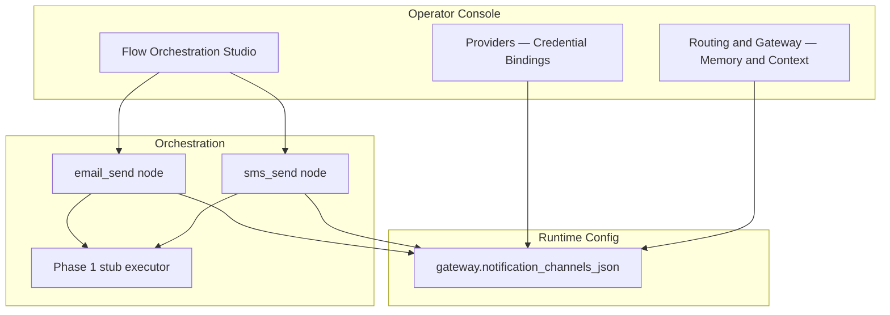

# Flow Orchestration Notification Channels — Impact Analysis (GOV-FLOW-NOTIFY-001)

## Document Control

| Field | Value |
|---|---|
| Scope | Email/SMS notification channel registry + Flow Orchestration `email_send` / `sms_send` nodes (Phase 1 stub) |
| Status | Implemented — pending CISO sign-off |
| Primary controls | RSK-018 / CC-032 |
| Related | GOV-FLOW-ORCH-001, GOV-USP (credential bindings), Playground escalation notify |
| Validation date | 2026-06-12 |

## Purpose

Introduce a governed notification channel registry (`gateway.notification_channels_json`) and dedicated Flow Orchestration node types for operator-authored email and SMS steps — without inline provider secrets and with Phase 1 simulated delivery only.

## Scope and Affected Modules

| Module | Impact |
|---|---|
| MOD-GATEWAY | Notification channel registry, `GET /gateway/notification-channels*`, runtime config validation |
| MOD-RUNTIME | `gateway.notification_channels_json` key, dual-approval on sensitive registry mutation |
| MOD-OBS | Audit `gateway.notification_channel.context.read`; flow run step_results include simulated delivery metadata |
| MOD-EXT | Phase 2 outbound SendGrid/Twilio/SMTP webhook adapters (not shipped in Phase 1) |

## Existing Design Review

### HTTP workaround (current)

Operators can model email/SMS today via `http_request` nodes to allowlisted hosts (e.g. SendGrid REST). Gaps:

- No first-class channel registry or provider posture bundle
- Auth uses `auth_binding_id` per node — duplicated config across flows
- No recipient-template secret scanning specific to PII/notification abuse
- HTTP allowlist default deny is correct for SSRF but poor UX for notification providers

### Playground escalation notify (`escalation_notify.py`)

`POST /playground/quality/triage/escalations/{escalation_id}/notify` delivers trust-ops handoffs with channel/destination metadata and audit evidence. Patterns reused:

- Simulated delivery for `email://`, `sms://`, pagerduty/slack scheme destinations
- Real HTTP webhook POST with retry for https destinations
- Audit action `playground.feedback.triage.escalation.notify`

Flow Orchestration notification nodes are **separate** — registry-backed, credential-binding-only, and count toward flow node limits.

### Credential binding model (Providers)

Channels reference `credential_binding_id` only (same three-layer model as HTTP auth and vector secret refs). No inline API keys in registry JSON or flow graph JSON.

## Proposed Enhancement Architecture



### Registry schema (per channel)

| Field | Required | Notes |
|---|---|---|
| `channel_id` | Yes | Unique lowercase id |
| `provider_type` | Yes | `sendgrid`, `twilio`, `smtp_webhook`, `generic_http` |
| `enabled` | Yes | Boolean |
| `environment` | Yes | `dev`, `staging`, `prod` |
| `from_address` | When enabled email types | Sender email or SMS from number |
| `default_recipient_domain_allowlist` | No | Phase 2 enforcement hook |
| `credential_binding_id` | When enabled | Providers binding ref only |
| `api_base_url` | No | Provider API base |
| `metadata` | No | Opaque operator metadata |

### Orchestration node types

| Type | Required config | Phase 1 runtime |
|---|---|---|
| `email_send` | `channel_id`, `to_template`, `subject_template`, `body_template` | `{simulated: true, channel_id, to, subject, body, delivery_status: simulated}` |
| `sms_send` | `channel_id`, `to_template`, `body_template` | `{simulated: true, channel_id, to, body, delivery_status: simulated}` |

Optional: `from_override` on both types (validated; no secrets).

## Role-Lens Review

### Security Architect

- **Authz:** `GET /gateway/notification-channels*` requires Gateway read roles (Auditor+). Registry mutation via Runtime Config Studio with sensitive-key dual approval.
- **Secret handling:** Inline `api_key`, `token`, `password`, etc. rejected on registry save. Flow nodes use `channel_id` only; `to_template` scanned for inline secret patterns (`sk-`, `bearer`, etc.).
- **Abuse cases:** Mass notification spam deferred to Phase 2 rate limits; Phase 1 stub eliminates live send abuse. Prod flows still require approval; notification nodes count toward `orchestration.max_nodes_per_flow`.

### Audit Architect

| Action | `action_type` |
|---|---|
| Notification channel context read | `gateway.notification_channel.context.read` |
| Flow validate with notification nodes | `orchestration.flow.validate` |
| Flow run (simulated send) | `orchestration.flow.run` |

Deny paths on validation failures emit `orchestration.flow.*` with `decision_outcome=deny`.

### CISO

**Blast radius:** Phase 1 limited to simulated delivery — no live provider calls from orchestration executor. Registry holds binding refs only; compromise of flow JSON does not expose provider keys.

**Prod dual-approval:** Unchanged — prod flow approve + prod run gates apply. Sensitive registry key `gateway.notification_channels_json` requires dual approval on mutation (same class as vector store registry).

**Residual risk:** RSK-018 extended — operators may assume simulated runs imply live delivery readiness. Phase 2 live send increases spam/phishing blast radius without rate limits and domain allowlist enforcement.

**Go/no-go:**

| Phase | Decision | Rationale |
|---|---|---|
| Phase 1 (stub registry + nodes) | **Go** | Operator design, validation, audit, credential-binding discipline without live outbound |
| Phase 2 (live SendGrid/Twilio) | **No-go until** | Per-channel rate limits, recipient domain allowlist runtime enforcement, delivery audit events, and CISO sign-off |

### AWS Engineer

No new AWS IAM surfaces in Phase 1. Phase 2 Twilio/SendGrid may use existing secret provider backends (AWS Secrets Manager) via credential bindings — unchanged from CC-026.

### Cloud Engineer

- **Runtime config:** Key `gateway.notification_channels_json` default `[]`; validated on PUT/validate like vector stores.
- **Rollback:** Disable channel (`enabled: false`) or revert runtime config revision; flows referencing removed channels fail validation.
- **Observability:** Context endpoint exposes posture; Phase 2 adds delivery metrics.

### AI Architect

Notification templates may include LLM-generated content from prior steps — operators should treat `body_template` as outbound trust boundary in Phase 2. Phase 1 stub records template values in `step_results_json` for review without delivery.

### Frontend UI Expert

- Routing & Gateway **Memory & Context → Platform Configuration** includes notification channel registry table (mirrors vector store pattern).
- Flow Studio **Notify** category widgets with channel picker (`GET /gateway/notification-channels`) and link to Routing & Gateway setup.
- Client hints: no inline secrets in recipient templates.

### Security Engineer Expert

| Test | Asserts |
|---|---|
| `test_gateway_notification_channels.py` | Registry validation, list/context API, inline secret rejection |
| `test_orchestration_flows.py` (notification) | Node catalog, channel registry membership, secret in `to_template` rejection, stub run output |

Run:

```bash
python3 -m pytest backend/tests/test_orchestration_flows.py backend/tests/test_gateway_notification_channels.py -q
node --check frontend/app.js
```

## API and UI Coverage

| Endpoint | UI location | Coverage |
|---|---|---|
| `GET /gateway/notification-channels` | Routing & Gateway registry table; Flow Studio channel picker | Full |
| `GET /gateway/notification-channels/{channel_id}/context` | Platform Configuration row action | Full |
| `PUT /runtime-config/gateway.notification_channels_json` | Platform Configuration Save | Full |
| `email_send` / `sms_send` node types | Flow Orchestration Studio | Full |

## Cross-References

- GOV-FLOW-ORCH-001 — base orchestration controls; node type table updated for `email_send` / `sms_send`
- `unified-secret-provider-ciso-gap-analysis.md` — credential binding pattern
- Playground escalation notify — adjacent trust-ops notification path (not replaced)

## CISO Decision

| Decision | Owner | Date | Notes |
|---|---|---|---|
| ☐ Approve Phase 1 (stub registry + nodes) | CISO Delegate | | |
| ☐ Approve with conditions for Phase 2 live send | CISO Delegate | | Rate limits + domain allowlist enforcement required |
| ☐ Reject | CISO Delegate | | |
