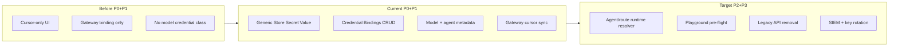

# Generic Provider Configuration — Final Review and Classification Register

## Document Control

| Field | Value |
|---|---|
| Document ID | GOV-GPC-FINAL-001 |
| Scope | Full classification review, UI/architecture assessment, and impact analysis for cloud AI model providers, secret storage, workload identity, and credential consumption |
| Status | **Final v1.1** — P0 + P1 design and development shipped |
| Validation date | 2026-06-10 |
| Supersedes | Informal review notes; partial `unified-secret-provider-ciso-gap-analysis.md` UI sections (Cursor-specific items retained there for CISO sign-off) |
| Canonical role | **Single operator + architecture reference** for provider configuration across all cloud AI vendors |

### Related documentation (cross-linked)

| Document | Relationship |
|---|---|
| `unified-secret-provider-ciso-gap-analysis.md` | Cursor credential CISO controls, CC-026, test matrix, sign-off checklist |
| `aws-integration-and-multicloud-model-fallback.md` | Multi-cloud route fallback and workload identity runbook |
| `api-inventory-and-ui-map.md` | Endpoint-level UI coverage truth |
| `ui-api-design-coverage-map.md` | Domain-level product intent |
| `documentation-source-of-truth.md` | Governance hierarchy |
| `frontend/README.md` | Operator-facing UI capabilities |

### Review completion checklist

| Review area | Reviewed | Evidence |
|---|---|---|
| Tenant type classification | Yes | UI + `TenantCatalogEntry` + schemas |
| Provider pillar taxonomy (4 pillars) | Yes | Providers console tabs + models |
| Workload identity provider types (cloud + AI) | Yes | `providers.py`, UI picker, env injection |
| Secret provider backend types | Yes | db / vault / aws-secrets-manager / azure-key-vault |
| Credential plane classification | Yes | Runtime resolution paths in `gateway.py` |
| Secret ref naming classification | Yes | P0 templates + prefix guardrails |
| Gateway binding version classification | Yes | v3 vs legacy storage_mode |
| Model lifecycle + approval classification | Yes | Supported model catalog schemas |
| Tenant entitlement classification | Yes | Entitlement CRUD + gateway enforcement |
| Environment classification (dev/prod) | Yes | Dual approval on prod mutations |
| IGA role classification for provider ops | Yes | `router_constants.py` role sets |
| Data sensitivity / secret handling classification | Yes | Encryption, masking, audit |
| Full UI review by console | Yes | All consumer consoles listed below |
| P0 UX remediation | Yes | Shipped 2026-06-10 |
| Multi-lens impact analysis | Yes | Part 5 comprehensive impact (17 subsections) + Part 6 lenses |
| Consolidated gap register | Yes | GAP-GPC + GAP-USP cross-walk |

---

## Executive Summary

The platform uses a **four-pillar provider model** scoped by tenant, with **three credential planes** for runtime resolution. A full classification review confirms:

1. **Taxonomies are implemented in backend schemas** but were not previously documented in one register.
2. **Cursor gateway credentials** are production-ready via unified secret providers (v3 binding).
3. **Other cloud AI vendors** share APIs and UI; P0 closed operator confusion; **P1 credential bindings** closed the configuration/governance gap. **P2 runtime resolver** (agent/route consumption) is the highest remaining functional gap.
4. This document is the **final consolidated reference** for classifications, UI state, gaps, and remediation.

---

## Part 1 — Complete Classification Register

### 1.1 Tenant scope classification

| Class | Values | UI location | Governance intent |
|---|---|---|---|
| **tenant_type** | `enterprise`, `regulated`, `sandbox`, `shared-services`, `internal` | Providers → Tenants | Signals approval rigor and data-handling expectations |
| **tenant_status** | `active`, `inactive` | Providers → Tenants | `inactive` blocks new onboarding; preserves audit lineage (no hard delete) |

**IGA rule:** All workload profiles, secret providers, and model entitlements require an **active** tenant.

---

### 1.2 Provider pillar classification

| Pillar | Entity | Primary UI tab | API prefix |
|---|---|---|---|
| **P1 — Tenant scope** | `TenantCatalogEntry` | Tenants | `/providers/tenants` |
| **P2a — Workload identity** | `WorkloadIdentityFederationProfile` | Workload Identity | `/auth/workload-identity/*` |
| **P2b — Secret provider** | `SecretProviderConfig`, `SecretProviderStoredValue` | Secret Providers | `/secrets/providers/*` |
| **P3 — Model catalog** | `SupportedModelCatalogEntry` | Models & Entitlements | `/providers/models/*` |
| **P3 — Entitlement** | `TenantModelEntitlement` | Models & Entitlements | `/providers/tenant-model-entitlements/*` |
| **P4 — Runtime consumer** | Agents, Gateway routes, Playground, Modules | Multiple consoles | Consumer-specific APIs |

---

### 1.3 Workload identity — provider_type classification

| Category | provider_type values | Credential mechanism | UI store secret? |
|---|---|---|---|
| **Cloud IAM** | `aws`, `aws-sts`, `azure`, `azure-entra`, `google`, `google-cloud`, `nvidia`, `nvidia-nim` | STS AssumeRole / OAuth / metadata token | No — federation + optional bootstrap |
| **AI vendor (runtime token)** | `openai`, `anthropic`, `cohere`, `mistral`, `groq`, `together`, `fireworks`, `perplexity`, `xai`, `cursor` | `{PREFIX}_WORKLOAD_IDENTITY_ACCESS_TOKEN` env injection | No — ops/sidecar injects at runtime |
| **Aliases** | `claude`→anthropic, `mistralai`→mistral, `togetherai`→together, `fireworksai`→fireworks, `x-ai`→xai | Same as target vendor | No |

**P0 UI:** Workload onboard tab includes AI vendor env-injection help panel.

---

### 1.4 Secret provider — provider_type classification

| provider_type | Storage / read adapter | UI onboard | UI store value (db only) | External write path |
|---|---|---|---|---|
| `db` | `secret_provider_stored_values` (Fernet) | Full | **Full (P0)** — Store Secret Value + templates | N/A — platform DB |
| `vault` | HTTP KV read | Full | N/A | Operator writes to Vault path |
| `aws-secrets-manager` | boto3 GetSecretValue | Full | N/A | Operator writes to AWS SM |
| `azure-key-vault` | HTTP + bootstrap bearer | Full | N/A | Operator writes to AKV |

**Connection metadata classification:** `provider_address`, `auth_method`, `role_or_mount`, `bootstrap_token` — all **encrypted at rest** (`[ENCRYPTED]` placeholder in list views).

---

### 1.5 Credential plane classification

| Plane ID | Description | Config shape | Plaintext in platform DB? | Prod recommendation |
|---|---|---|---|---|
| **CP-REF** | Secret provider reference | `{ secret_provider_id, secret_ref }` | No (ciphertext in db store or external vault) | **Preferred** |
| **CP-WIF** | Workload identity federation | `{ workload_identity_profile_id, subject }` + runtime token | No | **Preferred for cloud IAM** |
| **CP-ENV** | Runtime env injection (AI vendors) | `{VENDOR}_WORKLOAD_IDENTITY_ACCESS_TOKEN` | No | Acceptable with ops attestation |
| **CP-LEGACY** | Deprecated direct gateway token | `{ storage_mode: db\|external, token? }` | Was yes for db mode | **Deprecate** — migrate to CP-REF v3 |

**Gateway v3 binding classification:**

| binding_version | storage_mode (legacy) | Runtime resolver |
|---|---|---|
| `v3` | n/a | `_read_external_secret_value(secret_provider_id, secret_ref)` |
| legacy | `db` | Direct token in runtime_config (deprecated) |
| legacy | `external` | External provider ref (migrates to v3 on write) |

---

### 1.6 Secret ref naming classification

| Ref class | Pattern | Examples | Prefix guardrail |
|---|---|---|---|
| **Gateway integration** | `gateway/{integration}-token` | `gateway/cursor-token` | `gateway/` |
| **Vendor API key** | `providers/{vendor}/api-key` | `providers/openai/api-key` | `providers/` |
| **Cloud credential** | `providers/{cloud}/…` | `providers/aws/bedrock-credentials`, `providers/azure/openai-key` | `providers/` |
| **Custom** | Tenant-defined (must match prefixes) | `providers/team-a/openai-key` | JSON prefix list on provider |

**P0 UI templates:** Gateway Cursor, OpenAI, Anthropic, Cohere, Mistral, Groq, Azure OpenAI, AWS Bedrock, Custom.

**Data sensitivity class:** All stored values = **Restricted / Credential Material** — never returned plaintext; masked hint only (`****` pattern).

---

### 1.7 Supported model — lifecycle classification

| Field | Values | Meaning |
|---|---|---|
| **status** | `active`, `beta`, `deprecated`, `disabled` | Operator-facing model availability |
| **approval_status** | `pending`, `approved`, `rejected` | Governance gate before prod routing |
| **environment** (approval) | `dev`, `prod` | Prod may require dual approval |

**P1 (GAP-GPC-R04 closed):** Catalog rows support **credential_source_class** (`cp_ref`|`cp_wif`|`cp_env`) and optional **default_binding_id** on upsert and in the Models UI.

---

### 1.8 Tenant model entitlement classification

| Field | Values | Enforcement |
|---|---|---|
| **status** | `active`, `inactive` | Gateway rejects `provider/model` without active entitlement when tenant_id supplied |
| **scope** | tenant_id + provider_type + model_name | Per-tenant allow list |

---

### 1.9 Environment and approval classification

| Mutation class | dev | prod |
|---|---|---|
| Secret provider create | MFA + admin roles | MFA + admin roles |
| db secret value upsert/delete | MFA + security roles | MFA + security roles |
| Gateway cursor secret binding | MFA + security roles | **Dual approval** (Security Approver ↔ Platform Admin) |
| Credential binding create/update/delete | MFA + security roles | **Dual approval** in prod runtime |
| Supported model approval | Ticket + note | Ticket + note; dual approval when configured |
| Workload token exchange | MFA + admin roles | MFA + admin roles; token exposure disabled outside dev/test |

---

### 1.10 IGA role classification (provider operations)

| Role set | Roles | Typical operations |
|---|---|---|
| `PROVIDERS_ADMIN_ROLES` | Platform Admin, Super Admin, Master Admin | Tenant CRUD, provider onboard, model upsert |
| `PROVIDERS_ADMIN_SECURITY_ROLES` | Above + Security Approver | Secret value upsert/delete, gateway binding |
| `PROVIDERS_ADMIN_SECURITY_AUDITOR_ROLES` | Above + Auditor | List/read masked status, audit evidence |
| `PROVIDERS_ADMIN_SECURITY_RELEASE_ROLES` | Above + Release Manager | Release-sensitive provider mutations |
| `GATEWAY_INFERENCE_ROLES` | Inference operators | Gateway `/v1/*` — consumes bindings, does not mutate secrets |

**IGA gap:** No distinct **Secret Administrator** vs **Model Publisher** role separation per tenant in UI (backend uses platform roles only).

---

### 1.11 Module integration classification (non-secret)

| Field | Values | Classification |
|---|---|---|
| **integration_provider** | `none`, `cursor`, `github`, `gitlab`, `aws`, `azure`, `gcp` | **Metadata / URI reference only** |
| **integration_reference** | URI string | **Not credential storage** — P0 warning in Modules UI |

---

### 1.12 Consumer → credential plane mapping

| Consumer | Primary credential plane | UI configuration path | Classification gap |
|---|---|---|---|
| Gateway (Cursor) | CP-REF v3 | Store Secret Value → Gateway Binding **or** Credential Binding `gateway/cursor` | None |
| Gateway (multi-provider routes) | CP-WIF / CP-ENV / CP-REF | Routing priority + Providers | No per-hop bind UI; API supports `consumer_type=route` (GAP-GPC-R02) |
| Agents | CP-REF / CP-WIF (config + runtime) | Agents → Credential Binding picker | Route bindings still pending (GAP-GPC-R02 partial) |
| Playground | Inherits gateway/route | Playground Studio | P0 readiness indicator only (GAP-GPC-R05) |
| Modules | Metadata only | Modules → integration_reference | Correctly non-secret |
| Cost | N/A (catalog) | Cost console | Acceptable |

---

## Part 2 — Architecture Summary

### Clean architecture layers

| Layer | Responsibility | Assessment (2026-06-10) |
|---|---|---|
| **Domain** | Tenant-scoped entities; encrypted fields; reference-only bindings | Solid |
| **Application** | MFA, dual approval, audit, prefix guardrails, entitlements | Strong for Cursor path |
| **Infrastructure** | Vault/AWS/Azure/db adapters; STS; env injection | Complete; dual-plane complexity |
| **Presentation** | Providers console + consumer deep links | P0 improved; P1 bindings pending |

### Three credential planes (operator view)

```
┌─────────────────────────────────────────────────────────────┐
│  CP-REF: Secret Provider ID + Secret Ref (PREFERRED)        │
│  db | Vault | AWS SM | Azure KV  →  Store Secret Value (UI) │
├─────────────────────────────────────────────────────────────┤
│  CP-WIF: Workload Identity  →  STS / OAuth federation       │
├─────────────────────────────────────────────────────────────┤
│  CP-ENV: {VENDOR}_WORKLOAD_IDENTITY_ACCESS_TOKEN (AI keys)  │
├─────────────────────────────────────────────────────────────┤
│  CP-LEGACY: /gateway/cursor-token (DEPRECATED → migrate v3) │
└─────────────────────────────────────────────────────────────┘
```

---

## Part 3 — Full UI Review (Final State Post-P0)

### Providers Console

| Tab | Assessment | P0 changes |
|---|---|---|
| Overview | Full | Store Secret Value chip + workflow text |
| Tenants | Full | — |
| Workload Identity | Full | AI vendor env-injection help |
| Secret Providers | Full | Store Secret Value + Credential Bindings + gateway bind |
| Models & Entitlements | Full | credential_source_class + default_binding_id fields |

### Other consoles

| Console | Assessment | P0 changes |
|---|---|---|
| Routing & Gateway | Full (Cursor path) | Link to Store Secret Value |
| Agents | Full (bind picker) | Credential status + binding select + deep link |
| Playground | Partial | Step 0 credentials + readiness + chip |
| Modules | Full | integration_reference warning |
| Security | Partial (IGA) | Directory/SSO — no secret ownership view |
| Cost | Full (FinOps) | — |

---

## Part 4 — Consolidated Gap Register

### Closed

| ID | Gap | Resolution | Date |
|---|---|---|---|
| GAP-GPC-01 | Split Cursor token config | Unified secret provider + v3 binding | 2026-06-10 |
| GAP-GPC-02 | No db secret provider type | Migration 0028 + APIs | 2026-06-10 |
| GAP-GPC-03 | Secret value field hard to find | Store Secret Value card + highlight | 2026-06-10 |
| GAP-USP-01 | Dual Gateway vs Providers config | Single Providers path | 2026-06-10 |
| GAP-USP-02–05 | db type, runtime binding, docs, tests | See unified-secret-provider doc | 2026-06-10 |
| **P0** | Cursor-only labeling; missing templates; missing cross-links | Generic UI + templates + readiness | 2026-06-10 |

| **P1** | Generic credential binding API/UI | Generic Credential Bindings + model metadata + agent picker | 2026-06-10 |

### Open — functional

| ID | Gap | Severity | Status |
|---|---|---|---|
| GAP-GPC-R01 | Generic store UI (non-Cursor consumer bindings) | High | **Closed (P1)** |
| GAP-GPC-R02 | No consumer credential bindings beyond gateway Cursor | High | **Partial (P1)** — agent + gateway sync; route UI in P2 |
| GAP-GPC-R03 | AI vendor env injection not documented in UI | Medium | **Partial** — P0 help panel |
| GAP-GPC-R04 | Model catalog lacks credential_source classification | Medium | **Closed (P1)** |
| GAP-GPC-R05 | Agents/Playground credential readiness | Medium | **Partial** — P0 status + P1 agent binding |
| GAP-GPC-R06 | External vault path UI for non-gateway consumers | Medium | Open — P2 |
| GAP-GPC-R07 | Bootstrap token rotation UI | Low | Open |
| GAP-GPC-R08 / GAP-USP-R03 | Legacy `/gateway/cursor-token` callable | Low | Tracked — remove 2026-09-01 |

### Open — operational / security

| ID | Gap | Owner |
|---|---|---|
| GAP-GPC-R09 / GAP-USP-R04 | `SECRET_ENCRYPTION_KEY` rotation automation | PAM / Cloud Security |
| GAP-GPC-R10 / GAP-USP-R05 | SIEM for `secret_provider.value.upsert` spikes | SecOps / CISO |
| GAP-GPC-R11 / GAP-USP-R01 | Remote rotate-via-secret-provider execution | Security Engineering |
| GAP-USP-R02 | Lease renew = platform metadata only | Cloud Engineering |

---

## Part 5 — Full Impact Analysis (Comprehensive)

This section is the authoritative impact assessment for P0 (UX clarity) and P1 (credential bindings). It covers architecture, stakeholders, security, operations, data, runtime behavior, blast radius, and deferred work.

### 5.1 Change inventory

| Change ID | Component | Type | Shipped | Primary beneficiary |
|---|---|---|---|---|
| CHG-GPC-P0-01 | Generic **Store Secret Value** + ref templates | UI | Yes | Operators (all vendors) |
| CHG-GPC-P0-02 | Workload AI vendor env-injection help | UI/docs | Yes | Cloud / AI ops |
| CHG-GPC-P0-03 | Agents/Playground credential readiness + deep links | UI | Yes | Agent / playground operators |
| CHG-GPC-P0-04 | Modules integration_reference warning | UI | Yes | Security (anti-pattern prevention) |
| CHG-GPC-P1-01 | `provider_credential_bindings` table + migration 0029 | Data | Yes | Platform / audit |
| CHG-GPC-P1-02 | `/providers/credential-bindings` CRUD API | API | Yes | Integrations / UI |
| CHG-GPC-P1-03 | Gateway `cursor` binding auto-sync to v3 runtime config | Runtime | Yes | Gateway inference |
| CHG-GPC-P1-04 | Model `credential_source_class` + `default_binding_id` | Data/API/UI | Yes | CISO / AI governance |
| CHG-GPC-P1-05 | Agent `credential_binding_id` field | Data/API/UI | Yes | Agent operators |
| CHG-GPC-P1-06 | Providers **Credential Bindings** console | UI | Yes | Operators (all consumers) |
| CHG-DEFER-01 | Agent runtime credential resolver | Runtime | **Yes (P2)** | Agents at inference |
| CHG-DEFER-02 | Route consumer binding UI + resolver | UI/runtime | **No** | Routing / fallback |
| CHG-DEFER-03 | Playground binding/entitlement pre-flight | UI/runtime | **No** | Playground operators |

### 5.2 Impact by clean-architecture layer

| Layer | Before (pre-P0) | After (P0+P1) | Residual impact |
|---|---|---|---|
| **Presentation** | Cursor-branded secret form; no binding UI; agents had no credential picker | Generic store form, Credential Bindings table, model credential fields, agent binding select, cross-console deep links | Route/Playground consumers still lack bind UI; no binding inventory export |
| **Application** | Gateway-only v3 binding; no generic binding use cases | Binding CRUD with MFA, dual approval, audit, gateway cursor sync; **agent runtime resolver** | Route consumer runtime resolver still pending |
| **Domain** | `SecretProviderStoredValue`, gateway runtime_config binding | + `ProviderCredentialBinding`, model credential metadata, agent binding reference | No domain entity for binding→consumer health history |
| **Infrastructure** | db / Vault / AWS SM / Azure KV / env injection (split) | Unified binding record points to CP-REF or CP-WIF; gateway read path unchanged semantically | External vault paths still operator-managed outside UI for non-gateway consumers |

### 5.3 Stakeholder impact matrix (detailed)

| Stakeholder | Pre-change pain | Current state (P0+P1) | Residual impact | Compensating control |
|---|---|---|---|---|
| **Operators** | Cursor-only UX; secret field hidden; no vendor templates | Five-step pattern documented; Store Secret Value + Credential Bindings for all vendors | Must learn consumer_type/key semantics; route bindings manual/API only | Overview workflow + ref templates + inline help |
| **CISO** | Split audit paths; incomplete model→secret trace | Bindings auditable; model credential class; gateway sync; masked readback | Agent inference not yet bound to stored binding at runtime | Conditional prod approval; P2 runtime resolver |
| **IGA / IAM** | Tenant entitlements without credential ownership | Bindings tenant-scoped; role-gated mutations; dual approval in prod | No per-tenant secret-admin role; no access review UI for bindings | `PROVIDERS_ADMIN_SECURITY_*` roles; audit export |
| **Security Architect** | Dual credential planes undocumented in UI | CP-REF / CP-WIF classified; anti-patterns documented | Env injection (CP-ENV) still accepted for AI vendors | Mandate CP-REF for prod; env attestation |
| **Audit Architect** | `gateway.cursor_secret_binding.*` only for gateway | + `provider_credential_binding.*`, existing `secret_provider.value.*` | No single “tenant credential inventory” report | Audit API + binding list UI |
| **Cloud Architect** | Multi-cloud fallback without credential visibility | Bindings link routes/agents to secret refs or workload profiles | Route-level credential health not in UI | Health checks on secret providers; P2 route cards |
| **Cloud Security / AWS** | AWS SM via default boto3 chain | Unchanged; bindings can reference AWS SM provider IDs | IAM task role must be least-privilege (deployment concern) | Day-0 IAM runbook (documented gap) |
| **AI Architect** | Model approval decoupled from credential source | `credential_source_class` + `default_binding_id` on catalog | Fallback hops do not verify credential before attempt | Model approval + entitlement gates |
| **FinOps / Cost** | No credential path in cost views | Unchanged (acceptable) | None for current scope | — |
| **Frontend UX** | Cursor-first mental model | Generic labeling; tabbed flows; readiness indicators | Two gateway paths (legacy card + bindings sync) | Consolidation in P2 docs |
| **Security Engineer** | Tests for cursor binding only | + `test_provider_credential_bindings.py` | No E2E test for agent runtime resolve | P2 contract tests |

### 5.4 Impact by operator console

| Console | Endpoints touched | UX change | Runtime behavior change | Risk if misconfigured |
|---|---|---|---|---|
| **Providers → Secret Providers** | `/secrets/providers/*`, `/providers/credential-bindings/*`, `/gateway/cursor-secret-binding` | Store Secret Value, Credential Bindings, Gateway Binding card | Gateway cursor resolves via v3 when binding synced | Wrong provider_id/ref → inference auth failure |
| **Providers → Models** | `/providers/models/*` | credential_source_class, default_binding_id | None at inference (metadata only) | Stale default_binding_id → operator confusion |
| **Agents → Config Studio** | `/agent-configs/*` | Credential Binding picker | **None yet** — binding stored only | Orphan binding_id if binding deleted |
| **Routing & Gateway** | `/gateway/cursor-secret-binding`, `/v1/*` | Redirect/help links | Unchanged resolution path | Legacy cursor-token still callable (GAP-USP-R03) |
| **Playground** | `/gateway/cursor-secret-binding` (read) | Readiness status + Configure Credentials chip | Unchanged | Runs may fail if binding missing |
| **Modules** | — | integration_reference warning | None | Operators may still paste secrets (user error) |
| **Security** | `/auth/*` | None | None | IGA does not surface binding ownership |
| **Cost** | `/cost/*` | None | None | — |

### 5.5 Impact by classification dimension

| Classification | Records impacted | Mutation controls | Readback | Audit actions |
|---|---|---|---|---|
| **Tenant scope** | All bindings require active tenant | Tenant catalog gate on create | Tenant in list responses | `tenant_catalog.*` (existing) |
| **CP-REF (secret_ref)** | `secret_provider_id` + `secret_ref` | MFA + security roles; prefix on value upsert | Masked hint only | `secret_provider.value.*`, `provider_credential_binding.*` |
| **CP-WIF (workload_identity)** | `workload_identity_profile_id` | MFA + security roles | Profile ID masked hint | `provider_credential_binding.*`, `workload_identity.*` |
| **CP-ENV (env injection)** | Not in binding table | Ops-managed | N/A | Indirect via workload exchange |
| **Model lifecycle** | status + approval_status | Approval ticket + dual approval (prod) | Full catalog read | `supported_model.*` |
| **Model credential class** | cp_ref / cp_wif / cp_env | Set on model upsert | Visible in catalog | `supported_model.create/update` |
| **Consumer type** | gateway / agent / route / platform | Scoped uniqueness constraint | List/filter by consumer | `provider_credential_binding.*` |
| **Environment** | dev / prod | Prod dual approval on binding write/delete | Visible in binding row | Approver headers in audit context |

### 5.6 Security, compliance, and audit impact

| Control objective | Pre-change | Post-change | Evidence | Gap |
|---|---|---|---|---|
| No plaintext secret in API | Met for db store + gateway | Met; bindings return masked_hint only | Tests + API schemas | Legacy cursor-token (deprecated) |
| Least-privilege mutation | Met for secret values | + Binding CRUD gated by security roles + MFA | `test_provider_credential_binding_role_and_list` | No separate Secret Admin role |
| Prod dual approval | Gateway binding only | + Binding create/update/delete in prod runtime | `_required_binding_approver_role` | — |
| Audit completeness | Partial (gateway + secrets) | + `provider_credential_binding.create/read/list/update/delete` | Audit event assertions | SIEM rules not wired (GAP-USP-R05) |
| Encrypted at rest | Fernet for db values | Unchanged | Migration 0028 | Key rotation automation (GAP-USP-R04) |
| Path prefix guardrails | On db value upsert | Unchanged; bindings validate provider tenant match | Prefix deny tests | — |
| CC-026 / RSK-016 (Cursor token) | Partially mitigated by unified path | Further mitigated by bindings inventory + sync | unified-secret-provider doc | RSK-016 remains Open until CISO sign-off |

**Compliance mapping:** SOC2 CC6 (logical access), CC7 (monitoring), CC8 (change management) — binding mutations require MFA, dual approval in prod, and emit audit events. Evidence bundle should include binding list export (manual via API today).

### 5.7 IGA and access governance impact

| IGA capability | Before | After | Gap |
|---|---|---|---|
| Tenant isolation | Entitlements + provider tenant scope | + Binding tenant_id enforced | — |
| Role separation (publisher vs secret admin) | Platform-wide roles only | Same; bindings use security role set | Dedicated Secret Administrator role per tenant |
| Access reviews | Gateway access reviews exist | Bindings listable; not in access-review UI | Extend NHI/access-review patterns to bindings |
| Provisioning workflow | Manual | Documented five-step pattern | No automated provisioning template |
| Deprovisioning | Deactivate tenant | Deactivate binding status or delete | Orphan agent `credential_binding_id` if binding deleted |

### 5.8 Operational and cloud deployment impact

| Operation | Impact | Action required |
|---|---|---|
| **Database migration** | New table + 3 columns | Run Alembic `0029` or rely on `main.py` bootstrap DDL in dev/test |
| **Runtime config** | Gateway cursor may be updated by binding sync | Verify binding after deploy; no plaintext in config |
| **Secrets rotation** | Operators rotate via Store Secret Value; bindings unchanged (ref-only) | Update secret value; binding continues to work |
| **Multi-region** | Bindings in app DB; follow existing DB replication | No new cross-region concern |
| **Observability** | New audit action types | Add SIEM alerts for binding mutation spikes (GAP-USP-R05) |
| **Rollback** | Drop table/columns if reverting code | See §5.14 |

### 5.9 Data and schema impact

| Artifact | Change | Backward compatible | Notes |
|---|---|---|---|
| `provider_credential_bindings` | **New table** | Yes (additive) | Unique scope index |
| `supported_model_catalog_entries.credential_source_class` | **New column** default `''` | Yes | Optional metadata |
| `supported_model_catalog_entries.default_binding_id` | **New column** nullable | Yes | FK not enforced in DB |
| `agent_configs.credential_binding_id` | **New column** nullable | Yes | Stored; runtime resolver pending |
| `runtime_config` (gateway.cursor_api_token) | May be written by binding sync | Yes | v3 JSON unchanged |
| `secret_provider_stored_values` | Unchanged | Yes | — |

**Data volume estimate:** Low — one row per tenant/consumer/provider/environment binding; no secret plaintext stored in bindings table.

### 5.10 API and integration impact

| API | Breaking change? | New consumers | Deprecation |
|---|---|---|---|
| `POST/GET/PUT/DELETE /providers/credential-bindings` | No (additive) | Providers UI, future automation | — |
| `PUT /agent-configs/{key}` | No — optional `credential_binding_id` | Agents UI | — |
| `POST/PUT /providers/models` | No — optional credential fields | Models form | — |
| `GET/PUT/DELETE /gateway/cursor-secret-binding` | No | Still supported | Deprecated path via legacy cursor-token |
| External integrators | Can automate binding lifecycle | Must supply MFA + approver headers in prod | — |

### 5.11 Runtime behavior impact (critical honesty)

| Path | Resolves credential today? | Changed by P0+P1? |
|---|---|---|
| Gateway Cursor inference (`/v1/*`) | Yes — via v3 binding or legacy | **Yes** — Credential Binding `gateway/cursor` syncs v3 |
| Gateway Cursor Secret Binding card | Yes — direct v3 write | Unchanged (parallel path) |
| Agent inference | **Yes** — resolves `credential_binding_id` or scope binding at gateway inference | **Yes** — via `credential_resolution` + `_ensure_inference_credentials` |
| Route fallback execution | **No** per-hop credential binding | **No** |
| Workload identity exchange | Yes — env or STS | Unchanged |
| Playground runs | Inherits gateway/agent backends | Unchanged |

**Impact statement:** P1 closed configuration/governance; **P2 agent runtime resolver shipped** — gateway inference resolves agent bindings before execution. Route consumer runtime remains deferred.

### 5.12 Blast radius and failure-mode analysis

| Failure mode | Blast radius | Detection | Mitigation |
|---|---|---|---|
| Wrong binding → wrong secret ref | Gateway or future agent calls fail auth | Gateway risk summary; masked hint mismatch in UI | Test binding; Load Status on secret value |
| Binding deleted while agent references it | Agent config has orphan binding_id | Agent form shows stale ID | Validation on agent save (P2) |
| Duplicate scope binding create | 409 Conflict | API error | Unique index |
| Prod binding without dual approval | Blocked | 403 from API | Approver headers |
| DB compromise | Ciphertext only in stored values; bindings hold refs not secrets | SIEM | `SECRET_ENCRYPTION_KEY` protection |
| Legacy cursor-token write | Config drift to deprecated path | Deprecation header | Migrate to v3; remove 2026-09-01 |
| Gateway sync from wrong binding | All Cursor inference uses wrong token | Audit `provider_credential_binding.update` | Prod approval; peer review |

### 5.13 Test and regression impact

| Suite | Coverage added | Status |
|---|---|---|
| `test_provider_credential_bindings.py` | CRUD, gateway sync, RBAC, model credential class | Passing |
| `test_secret_provider_db_values.py` | db store, gateway binding, MFA, prefix | Passing (8 total with above) |
| Frontend `node --check frontend/app.js` | Syntax for binding handlers | Passing |
| Missing | Agent runtime resolver, route binding, binding delete orphan | P2 |

**Regression risk:** Low for existing gateway cursor path — sync writes same v3 format as manual Gateway Binding card.

### 5.14 Rollback and compatibility impact

| Rollback scenario | Safe? | Procedure |
|---|---|---|
| Revert frontend only | Yes | Old UI; API bindings remain |
| Revert backend API only | Partial | UI calls fail; gateway v3 config persists |
| Revert migration 0029 | Risky if bindings in use | Export bindings; drop table; clear agent binding_ids |
| Legacy cursor-token during transition | Yes | Still API-compatible with deprecation headers |

### 5.15 Residual risk cross-walk (GAP + RSK)

| ID | Statement | Impact after P0+P1 | Owner | Target |
|---|---|---|---|---|
| GAP-GPC-R02 | Agent/route runtime binding | **Partial** — agent runtime shipped; route UI/resolver pending | Platform Engineering | P2 route |
| GAP-GPC-R05 | Playground pre-flight | **Partial** — readiness read only | Frontend + AI | P2 |
| GAP-GPC-R06 | External vault path UI | Open | Cloud Engineering | P2 |
| GAP-USP-R03 | Legacy cursor-token API | Low; tracked | IAM Governance | 2026-09-01 |
| GAP-USP-R04 | Encryption key rotation | Medium | PAM Operations | 2026-07-30 |
| GAP-USP-R05 | SIEM for secret/binding mutations | Low | SecOps | 2026-07-15 |
| RSK-016 | Cursor token exposure | **Reduced** via unified path + bindings | Security Architecture | CISO sign-off |

### 5.16 Before / after / target comparison



| Dimension | Before | Current (P0+P1) | Target (P2+P3) |
|---|---|---|---|
| Operator UX | Cursor-centric | Generic multi-vendor config | Full consumer coverage |
| Governance trace | Partial | Model→binding→secret ref (config) | Runtime-enforced trace |
| Audit | Gateway + secrets | + binding lifecycle | + SIEM automation |
| Runtime | Gateway only | Gateway (+ stored agent binding) | All consumers |

### 5.17 Deferred-work impact if P2/P3 not completed

| If deferred | Business impact | Security impact | Operational impact |
|---|---|---|---|
| **P2 agent resolver** | Agents cannot use bound credentials automatically | Operators may assume binding works at runtime | Manual env injection continues |
| **P2 route bindings** | Fallback may hit provider without credential | Failed hops; opaque errors | Route ops rely on docs |
| **P3 legacy removal** | Two gateway config paths persist | Config drift risk | Audit noise from legacy API |
| **P3 SIEM** | Delayed anomaly detection | Secret/binding abuse undetected | Manual audit review |

### Remediation roadmap (unchanged status)

| Phase | Status | Scope |
|---|---|---|
| **P0** | **Complete (2026-06-10)** | Generic Store Secret Value, templates, env help, cross-links, readiness |
| **P1** | **Complete (2026-06-10)** | Credential bindings API/UI, model credential metadata, agent binding picker |
| **P2** | **Partial (2026-06-10)** | Agent runtime credential resolver; route bind cards + Playground pre-flight remain |
| **P3** | Planned | Legacy removal; key rotation UI; SIEM rules |

---

## Part 6 — Multi-Lens Review (Final v1.1)

| Lens | Decision | Key finding (post P0+P1) |
|---|---|---|
| **Security Architect** | **Conditional approve** | CP-REF + binding CRUD controls sound; mandate v3; agent runtime resolver required before claiming full agent credential governance |
| **Audit Architect** | **Approve** | `provider_credential_binding.*` + existing secret/gateway audit; export via API; SIEM rules still open (GAP-USP-R05) |
| **CISO** | **Conditional approve** | Cursor + binding inventory prod-ready for **configuration**; non-Cursor vendors need env attestation or CP-REF bindings; P2 runtime for agents |
| **AWS Engineer** | **Approve with IAM docs** | boto3 chain unchanged; bindings reference SM provider IDs; task-role least privilege remains deployment concern |
| **Cloud Engineer** | **Approve** | Migrations 0028 + 0029; gateway sync operational; rollback plan in Part 5 §5.14 |
| **AI Architect** | **Conditional approve** | Model credential class + default binding closed catalog gap; fallback hops still lack per-hop credential verify |
| **Frontend UI Expert** | **Approve** | P0 generic labeling + P1 Credential Bindings tab; consolidate dual gateway paths in P2 docs |
| **Security Engineer** | **Approve** | `test_provider_credential_bindings.py` + secret provider suite; add agent runtime contract tests in P2 |
| **IGA / IAM Governance** | **Conditional approve** | Role sets + dual approval on bindings; tenant secret-admin separation and access-review UI still missing |

---

## Part 7 — Operator Quick Reference (Final)

### Five-step pattern (all vendors)

1. **Scope** — active tenant  
2. **Register backend** — secret provider and/or workload identity  
3. **Store credential** — Store Secret Value (db) or external vault or env injection  
4. **Bind consumer** — **Credential Bindings** (all vendors/consumers) or **Gateway Cursor Secret Binding** (Cursor shortcut; syncs same v3 path)  
5. **Publish model** — catalog + credential source class + approval + entitlement  

### Cursor (full UI — two equivalent bind paths)

**Path A — Credential Bindings (generic):**

1. Secret Providers → create `db` (`platform://database`, prefixes `["gateway/","providers/"]`)  
2. **Store Secret Value** → `gateway/cursor-token`  
3. **Credential Bindings** → `consumer_type=gateway`, `consumer_key=cursor`, `credential_plane=secret_ref` → Save (auto-syncs v3)  
4. Models → register `cursor` → entitlements  
5. Routing & Gateway → inference  

**Path B — Gateway Cursor Secret Binding (legacy card):**

1–2. Same as above  
3. **Gateway Cursor Secret Binding** → Save  
4–5. Same as above  

### OpenAI / Anthropic / AI vendors

1. Workload Identity profile **or** db Store Secret Value (`providers/openai/api-key`, etc.)  
2. Ops: inject `{VENDOR}_WORKLOAD_IDENTITY_ACCESS_TOKEN` if using workload path  
3. **Credential Bindings** → bind `consumer_type=agent` or `gateway` as needed  
4. Models → register → set credential source class → approve → entitlements  
5. Agents → select model + credential binding (stored; runtime resolver P2)  

### AWS / Azure / GCP

1. Workload Identity → trust validate  
2. Optional Secret Providers (Vault/SM/KV)  
3. Models + entitlements  
4. Routing & Gateway → priority chain + fallback simulate  

---

## Part 8 — Validation Evidence

| Check | Command / location |
|---|---|
| Credential bindings CRUD + gateway sync + RBAC | `pytest tests/test_provider_credential_bindings.py -q` |
| Agent runtime credential resolution | `pytest tests/test_agent_credential_resolution.py -q` |
| db secret + gateway binding | `pytest tests/test_secret_provider_db_values.py -q` |
| Combined binding + secret suite | `pytest tests/test_provider_credential_bindings.py tests/test_secret_provider_db_values.py -q` |
| Legacy + secret provider suite | `pytest tests/test_phase0_phase1.py -k "cursor_token or secret_provider" -q` |
| Frontend syntax | `node --check frontend/app.js` |
| P0+P1 UI smoke | Providers → Store Secret Value + Credential Bindings; Agents binding picker; Agents/Playground credential status |

---

## Part 9 — CISO Decision Record

| Question | Final answer (v1.1) |
|---|---|
| All classifications reviewed? | **Yes** — Part 1 register (12 dimensions) |
| Full impact analysis complete? | **Yes** — Part 5 (§5.1–§5.17): stakeholders, layers, runtime honesty, blast radius, rollback |
| Final document created? | **Yes** — GOV-GPC-FINAL-001 v1.1 |
| Cursor path approved for prod? | **Yes** — configuration + gateway runtime; see `unified-secret-provider-ciso-gap-analysis.md` |
| P1 credential bindings approved for prod config? | **Yes** — MFA, dual approval, audit; gateway cursor sync verified in tests |
| All AI vendors approved end-to-end? | **No** — conditional: agent/route **runtime** resolver (P2) or env-injection attestation for CP-ENV |
| Required follow-up | P2 agent/route runtime resolver; GAP-USP-R03 removal 2026-09-01; SIEM rules (GAP-USP-R05) |

### Sign-off (pending)

| Role | Approve / Conditional / Deny | Date | Name |
|---|---|---|---|
| CISO Delegate | | | |
| Security Architect | | | |
| IGA Lead | | | |
| Cloud Architect | | | |

---

---

## Part 10 — P1 Design and Development (Shipped)

### API contract

| Method | Route | Purpose |
|---|---|---|
| POST | `/providers/credential-bindings` | Create binding |
| GET | `/providers/credential-bindings` | List with tenant/consumer/provider filters |
| GET | `/providers/credential-bindings/{binding_id}` | Read masked status |
| PUT | `/providers/credential-bindings/{binding_id}` | Update binding |
| DELETE | `/providers/credential-bindings/{binding_id}` | Delete binding |

**Binding scope key:** `tenant_id` + `consumer_type` + `consumer_key` + `provider_type` + `environment`

**Credential planes:** `secret_ref` | `workload_identity`

**Gateway sync:** bindings with `consumer_type=gateway`, `consumer_key=cursor`, `credential_plane=secret_ref` auto-update v3 runtime config.

### Data model additions

- `provider_credential_bindings` table
- `supported_model_catalog_entries.credential_source_class` (`cp_ref`|`cp_wif`|`cp_env`)
- `supported_model_catalog_entries.default_binding_id`
- `agent_configs.credential_binding_id`

### UI additions

- Providers → Secret Providers → **Credential Bindings** (form + table)
- Models form → credential source class + default binding ID
- Agents → Credential Binding picker

### Controls

- MFA + `PROVIDERS_ADMIN_SECURITY_ROLES` on write
- Prod dual approval (Security Approver ↔ Platform Admin)
- Masked readback only; audit events `provider_credential_binding.*`

### Tests

`backend/tests/test_provider_credential_bindings.py` — binding CRUD, gateway sync, RBAC, model credential class

### Known limitation (documented in Part 5 §5.11)

Route consumer bindings (`consumer_type=route`) are not yet resolved at fallback runtime. Agent bindings are resolved at gateway inference when `agent_id` matches an `agent_configs.agent_key`.

### P2 runtime resolver (shipped)

- `app/services/credential_resolution.py` — binding resolution for secret_ref and workload_identity planes
- Gateway `_ensure_inference_credentials` — resolves agent binding before all `/v1/*` inference endpoints
- `GET /agent-configs/{agent_key}/credential-status` — masked readiness for Agents UI

---

## Document history

| Version | Date | Change |
|---|---|---|
| Draft | 2026-06-10 | Initial review + impact analysis |
| P0 update | 2026-06-10 | P0 remediation reflected in gaps and UI sections |
| **Final v1.1** | 2026-06-10 | P1 design + development shipped; Part 5 full impact analysis (17 subsections) |
