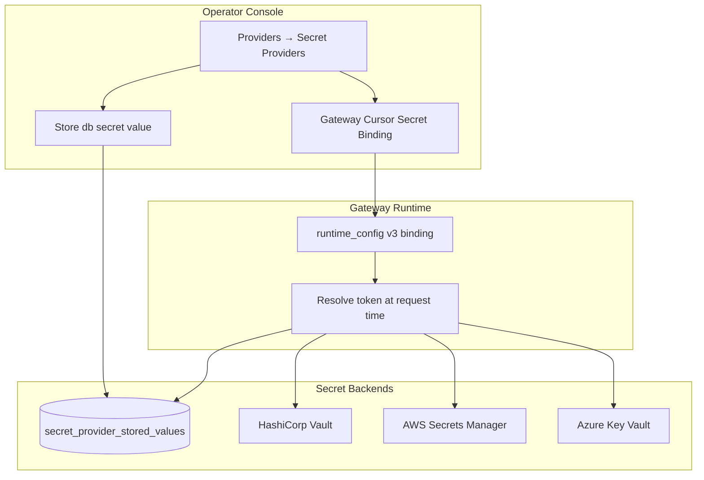

# Unified Secret Provider — Gap Analysis and CISO Review

## Document Control

| Field | Value |
|---|---|
| Scope | Consolidate gateway Cursor token configuration into Providers secret-provider model (`db`, Vault, AWS, Azure) |
| Status | Implemented — pending CISO sign-off |
| Primary controls | RSK-016 / CC-026 (updated) |
| Validation date | 2026-06-10 |
| Evidence tests | `backend/tests/test_secret_provider_db_values.py`, `backend/tests/test_phase0_phase1.py` (cursor-token suite), `backend/tests/test_provider_crypto_and_connectivity.py` |

## Related Documentation (synced)

| Document | Purpose |
|---|---|
| `backend/docs/governance/generic-provider-configuration-review-and-impact-analysis.md` | **Final v1.0** — complete classification register, UI review, consolidated gaps, operator reference (all vendors) |
| `backend/docs/governance/api-inventory-and-ui-map.md` | Endpoint-level coverage (`Full`/`Partial`/`Gap`) |
| `backend/docs/governance/ui-api-design-coverage-map.md` | Domain-level product intent and UI status |
| `backend/docs/governance/documentation-source-of-truth.md` | Canonical hierarchy and delta register |
| `backend/docs/governance/e2e-requirement-api-ui-verification.md` | Requirement-to-API-to-UI verification row |
| `backend/docs/governance/security-risk-closure-plan.md` | Closure tracker CL-009–CL-013 |
| `backend/docs/security/residual-and-accepted-risk-register.md` | CC-026 compensating control |
| `backend/docs/governance/operational-guide.md` | Operator playbook section 6.E |
| `docs/cursor-integration-operator-guide.md` | Cursor integration operator workflow |
| `frontend/README.md` | Operator-facing UI capabilities |
| `architecture-document.md` | Data model (`SecretProviderStoredValue`) |

## Executive Summary

Previously, operators configured Cursor credentials in two places:

1. **Routing & Gateway** — `db` (encrypted runtime config) or `external` (provider reference) via `/gateway/cursor-token`
2. **Providers** — external secret backends only (Vault/AWS/Azure)

This created split configuration, inconsistent audit paths, and operator confusion. The platform now uses **one secret-provider abstraction** for all backends, including a new **`db` provider type** for platform-encrypted storage.

Gateway resolution uses a single binding: `secret_provider_id` + `secret_ref` (`PUT /gateway/cursor-secret-binding`). Legacy `/gateway/cursor-token` remains API-compatible but is **deprecated**.

## Target Architecture



## Control Objectives and Mapping

| Control objective | Implementation | Audit evidence | Test evidence |
|---|---|---|---|
| No plaintext secret in API readback | Masked hints only on value status and binding reads | `secret_provider.value.read`, `gateway.cursor_secret_binding.read` | `test_db_secret_provider_store_value_and_gateway_binding_resolve` |
| Least-privilege mutation | MFA + admin/security roles for value upsert; dual approval for binding in prod | `secret_provider.value.upsert`, `gateway.cursor_secret_binding.update` | `test_secret_provider_value_role_and_mfa_enforcement`, binding role tests |
| Encrypted at rest (`db`) | Fernet via `SECRET_ENCRYPTION_KEY` / dev fallback | DB ciphertext in `secret_provider_stored_values` | DB row assertion in store test |
| Tenant scope for providers | Active tenant catalog required before provider create | `secret_provider.create`, `tenant_catalog.create` | Provider create tests |
| Path prefix guardrails | `secret_path_prefixes` enforced on db value writes | deny on out-of-prefix refs | `test_secret_provider_value_path_prefix_denied` |
| Gateway binding integrity | Active provider required; v3 binding only stores references | `gateway.cursor_secret_binding.update` | binding + deprecated migration tests |
| Deprecation safety | `Deprecation: true` header on legacy cursor-token endpoints | `gateway.cursor_token.*` (compat) | `test_deprecated_cursor_token_put_migrates_to_v3_binding` |
| Runtime read isolation | Gateway resolves via `_read_external_secret_value` unified path | gateway inference audit on failure | `test_gateway_openai_responses_runtime_token_failure` (phase0) |

## Gap Analysis

### Closed gaps (this change)

| ID | Prior gap | Resolution | Verification |
|---|---|---|---|
| GAP-USP-01 | Dual configuration surfaces (Gateway vs Providers) | Single Providers console + gateway binding card | UI in `frontend/views/providers.html`; Gateway card is redirect-only |
| GAP-USP-02 | No `db` type in secret provider catalog | `provider_type=db` with encrypted value table | Migration `0028_secret_provider_stored_values` |
| GAP-USP-03 | Gateway `db` mode stored token in runtime_config directly | Token stored in `secret_provider_stored_values`; runtime_config holds binding only | v3 JSON assertion in tests |
| GAP-USP-04 | Inconsistent operator docs | API inventory, coverage map, frontend README, operator guide updated | Doc cross-links in this file |
| GAP-USP-05 | Missing regression for unified path | Dedicated `test_secret_provider_db_values.py` | pytest pass |

### Remaining gaps (accepted / follow-up)

| ID | Gap | Risk | Compensating control | Owner | Target |
|---|---|---|---|---|---|
| GAP-USP-R01 | `rotate-via-secret-provider` delegates rotation without remote execution | Medium | Audit events + prod dual approval; manual rotation runbooks | Security Engineering | 2026-07-15 |
| GAP-USP-R02 | Lease renew is platform metadata only (not Vault lease API) | Low | Health/lease inventory + operator docs | Cloud Engineering | 2026-08-01 |
| GAP-USP-R03 | Legacy `/gateway/cursor-token` still callable | Low | Deprecation headers + migration to v3 on write | IAM Governance | Remove after 2026-09-01 |
| GAP-USP-R04 | No automated encryption-key rotation for `SECRET_ENCRYPTION_KEY` | Medium | Key management runbook (day-0 hardening doc) | PAM Operations | 2026-07-30 |
| GAP-USP-R05 | SIEM default rule + audit dispatch wired for `secret_provider.value.*`; volume-threshold correlation remains SIEM-side | Low | Default rule `siem-secret-provider-value-mutations` + `test_siem_alert_rules` | SecOps | 2026-08-02 |

## API and UI Coverage Matrix

| Endpoint | UI location | Coverage | Notes |
|---|---|---|---|
| `POST /secrets/providers` (`db`) | Providers → Onboard Secret Provider | Full | `db` in provider type picker |
| `PUT /secrets/providers/{id}/values` | Providers → Store Secret Value | Full | MFA required; vendor ref templates |
| `GET /secrets/providers/{id}/values/{ref}` | Providers → Load Status | Full | Masked readback |
| `DELETE /secrets/providers/{id}/values/{ref}` | Providers → Delete Value | Full | MFA required |
| `GET/PUT/DELETE /gateway/cursor-secret-binding` | Providers → Gateway Cursor Secret Binding | Full | Dual approval in prod |
| `GET/PUT/DELETE /gateway/cursor-token` | Routing & Gateway (deprecated notice) | Partial | API compat only |

## Test Validation Matrix

| Test | Asserts |
|---|---|
| `test_db_secret_provider_store_value_and_gateway_binding_resolve` | End-to-end db store → binding → v3 persistence → no plaintext in API/DB |
| `test_deprecated_cursor_token_put_migrates_to_v3_binding` | Legacy PUT migrates to v3 + Deprecation header |
| `test_secret_provider_value_role_and_mfa_enforcement` | Auditor denied write; MFA required for upsert |
| `test_secret_provider_value_path_prefix_denied` | Out-of-prefix secret_ref returns 403 |
| `test_gateway_cursor_secret_binding_role_and_audit` | Auditor denied binding write; audit on successful bind |
| `test_gateway_cursor_token_config_masks_readback_and_enforces_roles` | Legacy read path + role gates (phase0) |
| `test_gateway_cursor_token_external_provider_mode_persists_reference_only` | External vault binding via v3 (phase0) |

Run validation:

```bash
cd backend
python3 -m pytest tests/test_secret_provider_db_values.py -q
python3 -m pytest tests/test_phase0_phase1.py -k "cursor_token or secret_provider" -q
node --check ../frontend/app.js
```

## CISO Review Checklist

| # | Question | Expected answer | Evidence location |
|---|---|---|---|
| 1 | Is there a single operator path for Cursor credentials? | Yes — Providers secret provider + binding | `frontend/views/providers.html` |
| 2 | Can auditors retrieve plaintext secrets via API? | No — masked hints only | Value/binding GET tests |
| 3 | Are mutations role-gated and MFA-backed? | Yes — provider admin/security + MFA on value writes | `test_secret_provider_value_role_and_mfa_enforcement` |
| 4 | Is prod dual approval enforced for binding changes? | Yes — gateway binding PUT/DELETE | `gateway.py` `_required_gateway_secret_approver_role` |
| 5 | Are audit events emitted for all mutations? | Yes — `secret_provider.value.*`, `gateway.cursor_secret_binding.*` | Audit assertions in tests |
| 6 | What is blast radius if DB is compromised? | Ciphertext only; key in `SECRET_ENCRYPTION_KEY` | `secret_provider_values.py`, day-0 doc |
| 7 | Are legacy endpoints disabled? | No — deprecated with migration; scheduled removal GAP-USP-R03 | Deprecation headers |
| 8 | Are remaining gaps documented with owners? | Yes — GAP-USP-R01–R05 above | This document + residual risk register |

## Role-Lens Review Summary

| Lens | Assessment |
|---|---|
| Security Architect | Unified trust boundary reduces config drift; prefix guardrails and encrypted db store meet least-exposure intent. |
| Audit Architect | Distinct audit actions for value upsert/read/delete and binding read/update/clear; legacy actions retained for compat. |
| CISO | Residual gaps are bounded and tracked; recommend sign-off with GAP-USP-R01/R03/R04 follow-up dates. |
| AWS Engineer | AWS secret reads unchanged; db type is platform-local only. |
| Cloud Engineer | Migration `0028` required; binding stored in existing runtime_config key. |
| AI Architect | Gateway inference path unchanged semantically; resolution unified through secret provider adapter. |
| Frontend UI Expert | Operators guided to Providers; Gateway shows deprecation pointer. |
| Security Engineer Expert | Regression suite covers role/MFA/prefix/masking; expand SIEM rules per GAP-USP-R05. |

## CISO Decision

| Decision | Owner | Date | Notes |
|---|---|---|---|
| ☐ Approve unified secret provider for production | CISO Delegate | | |
| ☐ Approve with conditions (list GAP-USP-R*) | CISO Delegate | | |
| ☐ Reject — document required changes | CISO Delegate | | |

Conditions recommended if approving:

1. Track GAP-USP-R03 removal date for `/gateway/cursor-token` in release plan.
2. Assign GAP-USP-R04 encryption key rotation automation to PAM Operations.
3. Add SIEM detection for anomalous `secret_provider.value.upsert` rates (GAP-USP-R05).
