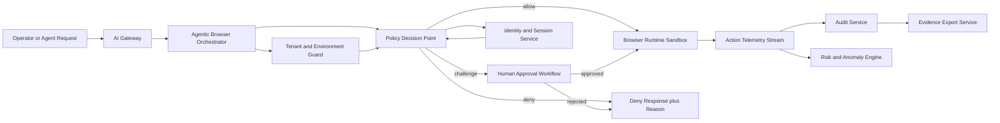
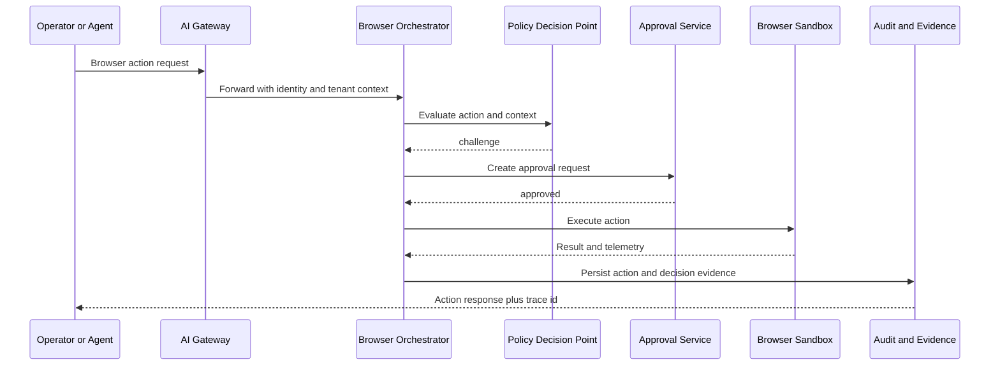

# Agentic Browser Security Platform

## Design Document and Similar Product Review

## 1. Context and Objective

You already have an AI Gateway. The next product should add a secure agentic browser control plane that allows autonomous browser actions while enforcing strict security, identity, policy, and audit controls.

Primary objective:

Build an agentic browser platform that is policy-first, identity-aware, and evidence-driven, so autonomous browser actions can be allowed, denied, challenged, or escalated safely.

## 2. Problem Statement

Typical browser automation tools optimize for speed and convenience, but not for governance-grade controls needed for enterprise AI operations.

Risks to address:

- Prompt injection and instruction hijacking through web content
- Unauthorized sensitive actions such as payment, data export, privilege changes
- Session takeover and token leakage
- Excessive permissions across tenants and environments
- Lack of explainable decision trails and forensic evidence

## 3. Product Principles

- Default deny for high-risk browser actions
- Identity-bound execution for every agent and browser session
- Policy evaluation before and during each action
- Human-in-the-loop checkpoints for risky operations
- Full audit trail with decision rationale and trace links
- Tenant and environment isolation by design
- Compatibility with existing AI Gateway controls and evidence flows

## 4. Scope

### In Scope

- Browser session governance
- Action-level preventive policy enforcement
- Runtime risk scoring and decisioning
- JIT access and dual-approval workflows
- RBAC plus owner scope constraints
- Forensic logging and evidence export
- Runtime policy/config validation APIs

### Out of Scope for Initial Version

- Full anti-fraud engine with external threat intel feeds
- Cross-org federated trust exchanges across multiple control planes
- Complex low-code workflow builder

## 5. Reference Architecture

## 6. Core Components

### 6.1 Agentic Browser Orchestrator

Responsibilities:

- Manages browser lifecycle and task execution
- Enforces per-action control hooks
- Routes each action through policy engine

### 6.2 Policy Decision Point

Responsibilities:

- Evaluate action intent, target, context, identity, environment, tenant
- Return allow, warn, challenge, or deny
- Return policy trace and remediation hints

### 6.3 Policy Administration

Responsibilities:

- Define policy templates and rule sets
- Publish versioned policy bundles
- Support dry-run and shadow mode

### 6.4 Identity and Session Governance

Responsibilities:

- Bind actions to actor identity and agent identity
- Enforce role, scope, MFA freshness, dual approval requirements
- Issue short-lived, signed session tokens

### 6.5 Human Approval Workflow

Responsibilities:

- Queue challenge-required actions
- Require approver role separation
- Capture reason code and decision metadata

### 6.6 Audit and Evidence

Responsibilities:

- Persist allow and deny evidence
- Link every action to trace id and policy version
- Export evidence bundles for Security and CISO reviews

## 7. Preventive Policy Model

Policy decisions are evaluated at action boundaries.

Action examples:

- navigate
- click
- type
- submit
- upload
- download
- copy_to_clipboard
- extract_data

Context dimensions:

- actor_role, actor_id, agent_id
- tenant_id, environment
- domain, url path pattern
- data_classification
- action_type and target element sensitivity
- risk_score and anomaly flags

Decision outcomes:

- allow
- warn
- challenge
- deny

Example policy behavior:

- Allow read-only navigation to approved domains
- Challenge file upload on external domains
- Deny credential submission to unknown domains
- Deny export of regulated data outside approved tenant context

## 8. Security and IAM Controls

### Identity and Access Management

- Role-based action authorization
- Owner scope checks for agent-owned sessions
- Least-privilege permission grants
- Separation of duties for approver vs actor

### Cloud and AWS posture

- Prefer workload identity and short-lived credentials
- No static long-lived secret tokens in runtime
- Strict role trust boundaries for AWS assume role paths
- Explicit environment gates for production mutation actions

### Session and secret controls

- Signed and expiring session tokens
- Token redaction in logs
- Secret provider integration for sensitive credentials

### Browser runtime hardening

- Isolated browser contexts per task
- Domain allowlist and network egress controls
- File operation policy controls
- Action throttling and cooldowns

## 9. Data Model (High Level)

Core entities:

- BrowserSession
- BrowserAction
- PolicyRule
- PolicyVersion
- PolicyDecisionEvent
- ApprovalRequest
- ApprovalDecision
- EvidenceArtifact

Key identifiers:

- trace_id for end-to-end correlation
- decision_trace_id for policy decision explanations
- tenant_id and environment for isolation

## 10. API Surface (Draft)

Control and policy APIs:

- POST /browser/sessions
- GET /browser/sessions
- POST /browser/sessions/{id}/actions
- GET /browser/sessions/{id}/actions
- POST /browser/policies/validate
- GET /browser/policies
- PUT /browser/policies/{policy_id}
- POST /browser/authz/explain

Approval and evidence APIs:

- POST /browser/approvals
- POST /browser/approvals/{id}/decide
- GET /browser/evidence/events
- POST /browser/evidence/export

## 11. End-to-End Flow

## 12. Similar Product Review

This section reviews adjacent products and what to learn from them.

### 12.1 Browserbase plus Stagehand

Strengths:

- Developer-friendly browser automation stack
- Good operational primitives for browser sessions

Gaps for your target:

- Governance and enterprise policy controls are not primary product focus
- Less opinionated around CISO-grade evidence and IAM controls

Takeaway:

Use this as benchmark for runtime reliability and developer experience, but add stronger policy and approval architecture.

### 12.2 Skyvern

Strengths:

- Agentic browser workflows and task abstraction
- Good starting point for autonomous web tasking

Gaps for your target:

- Enterprise IAM and formal preventive policy frameworks may need stronger layering
- Security governance and attestation needs additional productization

Takeaway:

Useful benchmark for autonomous execution UX; differentiate on security governance and traceable policy decisions.

### 12.3 UiPath and enterprise RPA platforms

Strengths:

- Mature governance model and enterprise controls
- Broad approval and operational management features

Gaps for your target:

- Heavier workflow model and less native AI-agent-first posture
- Developer velocity can be slower for AI-native teams

Takeaway:

Borrow governance and approval rigor; avoid heavyweight operational complexity.

### 12.4 Microsoft Power Automate and Copilot Studio style automation

Strengths:

- Strong enterprise integration and identity ecosystem
- Good human-in-the-loop workflows

Gaps for your target:

- Browser agent runtime control depth varies by scenario
- AI-gateway-native security controls are not the default center

Takeaway:

Adopt integrated approvals and role governance patterns while keeping your browser controls deeply runtime-aware.

### 12.5 Playwright-based custom stacks

Strengths:

- Max flexibility and direct control over browser actions
- Strong testing and runtime tooling ecosystem

Gaps for your target:

- No built-in policy, IAM, or governance framework
- Requires substantial custom security architecture

Takeaway:

Good execution substrate, but value comes from your policy and identity control plane built on top.

## 13. Competitive Positioning for Your Product

Your differentiator should be:

Policy-first secure agentic browser execution integrated with your existing AI Gateway governance.

Positioning pillars:

- Preventive policy enforcement before action execution
- Identity-aware and tenant-scoped decisioning
- CISO-ready audit and evidence exports
- Human approvals for high-risk actions
- Cloud and AWS posture with short-lived credential patterns

## 14. MVP Roadmap

### Phase 1

- Session lifecycle and action execution APIs
- Preventive policy engine with allow and deny
- Signed session tokens and actor binding
- Basic audit event model and trace ids

### Phase 2

- Challenge and approval workflow
- Explain endpoint for policy decisions
- Evidence export bundles
- Domain allowlist and sensitive action classifiers

### Phase 3

- Risk scoring and anomaly models
- Policy simulation and shadow mode
- Advanced data classification and redaction controls
- Enterprise integration pack for IAM and SIEM

## 15. Non-Breaking Integration Strategy with Existing AI Gateway

- Keep gateway contracts stable
- Add browser endpoints under a dedicated namespace
- Reuse existing audit, authz, and evidence conventions
- Reuse role model and dual-approval semantics
- Keep runtime-config keys additive and validated

## 16. Decision Summary

You should proceed with an AI-gateway-integrated, policy-first agentic browser security platform.

The design above gives you:

- certification workflows
- preventive policy configuration
- security, cloud, aws, ui, identity, and access governance alignment
- evidence-grade controls for enterprise and CISO operations

## 17. Feature Coverage Check

| Capability | Design Coverage | Readiness | Notes |
| --- | --- | --- | --- |
| Agentic browser session orchestration | Present | High | Covered via orchestrator and session APIs. |
| Preventive action policy (allow/warn/challenge/deny) | Present | High | Action and context model defined. |
| IAM role and owner-scope controls | Present | High | RBAC, owner scope, separation-of-duties included. |
| JIT and dual approval for high-risk actions | Present | High | Explicit challenge and approval workflow included. |
| CISO-grade audit and evidence export | Present | High | Evidence export and trace correlation included. |
| Tenant and environment isolation | Present | High | Isolation is part of principles and context model. |
| Cloud and AWS identity posture | Present | Medium | Principles defined; implementation blueprint should include concrete IAM policy examples. |
| Policy simulation and shadow rollout | Present | Medium | Mentioned in roadmap, not fully specified in rollout mechanics. |
| Browser runtime sandbox controls | Present | Medium | Core controls listed; requires more concrete control profiles per risk tier. |
| Supply-chain and dependency trust | Partial | Low | Not explicitly defined in current design and should be added in implementation plan. |
| Incident response and forensic runbooks | Partial | Medium | Evidence exists; operational playbooks should be explicitly listed. |
| Data residency and regulatory mapping | Partial | Medium | Needs explicit compliance mapping by region and control framework. |

## 18. Design Gaps to Close Before Implementation

1. Threat model completeness
- Add STRIDE-style threat model across browser runtime, policy engine, approval service, and evidence store.

2. Control mapping and compliance packs
- Map controls to SOC 2, ISO 27001, and (if needed) HIPAA/GDPR obligations.

3. AWS guardrail specifics
- Define reference IAM role trust policies, permission boundaries, and STS session-duration defaults.

4. Policy lifecycle governance
- Add policy rollout model: draft, shadow, canary, enforce, rollback.

5. Approval anti-abuse controls
- Add timeout, escalation, and anti-self-approval constraints in API contract.

6. Evidence integrity and retention
- Add artifact hashing/signing, retention windows, legal-hold behavior, and immutable storage profile.

7. Agentic-only delivery governance
- Require automated governance gate execution as part of release criteria.

## 19. Recommended MVP Acceptance Criteria

1. Security
- High-risk browser actions to sensitive domains are denied or challenged by default.
- All allow and deny decisions produce audit events with trace_id and policy version.

2. IAM and identity
- Every browser action is bound to actor_id, actor_role, tenant_id, and environment.
- Cross-owner access is blocked unless privileged role and policy permit it.

3. Approval workflow
- Challenge-required actions cannot execute without distinct approver identity.
- Approval decisions include reason_code and are audit logged.

4. CISO evidence
- Export endpoint produces signed or integrity-verifiable evidence bundle with decision and action lineage.

5. Operational readiness
- Shadow mode and rollback path exist for policy releases.
- Incident triage can pivot from action to policy decision to trace to evidence artifact.

## 20. Build Recommendation

Proceed with implementation after closing section 18 gaps in a short design hardening sprint. The current design is directionally correct and already stronger than most agentic browser competitors on governance posture, but the added details above will reduce rollout and audit risk significantly.

## 21. Deep Competitive Research Findings

This section expands the product review with a feature and design benchmark using publicly documented product positioning and documentation pages.

### 21.1 Research set

Reviewed categories:

- Agentic browser runtime vendors: Browserbase, Skyvern
- Browser execution substrate: Playwright
- Enterprise orchestration suites: UiPath, Automation Anywhere, Microsoft Power Automate

Primary evidence themes found across vendor sources:

- Agentic runtime reliability and scale claims
- Authentication handling (for example 2FA/CAPTCHA support)
- Governance and trust center posture
- Enterprise orchestration, approval, and admin guidance
- Developer extensibility and self-host options

### 21.2 Capability benchmark matrix

Scoring:

- 5 = strong first-class capability
- 3 = partial or indirect capability
- 1 = limited or custom-only

| Capability | Browserbase | Skyvern | Playwright | UiPath | Automation Anywhere | Power Automate | Target Platform Direction |
| --- | --- | --- | --- | --- | --- | --- | --- |
| Browser agent execution reliability | 5 | 4 | 5 | 2 | 2 | 2 | 5 |
| Native agentic browser tasking | 5 | 5 | 4 | 2 | 2 | 2 | 5 |
| Preventive policy engine (allow/warn/challenge/deny) | 2 | 2 | 1 | 4 | 4 | 3 | 5 |
| Action-level explainability and traceability | 3 | 4 | 3 | 4 | 4 | 3 | 5 |
| IAM depth and owner-scope enforcement | 2 | 3 | 1 | 5 | 5 | 5 | 5 |
| JIT approval and separation-of-duties controls | 1 | 2 | 1 | 5 | 5 | 4 | 5 |
| CISO-grade evidence export readiness | 2 | 3 | 2 | 5 | 5 | 4 | 5 |
| Cloud and AWS identity hardening posture | 3 | 3 | 2 | 4 | 4 | 4 | 5 |
| Self-host and deployment flexibility | 3 | 5 | 5 | 5 | 4 | 3 | 5 |
| Developer extensibility | 5 | 5 | 5 | 4 | 4 | 4 | 5 |

### 21.3 Vendor-level observations

Browserbase:

- Strong browser-as-infrastructure model and agent runtime primitives.
- Emphasizes web search/fetch/browser APIs and model-facing integration.
- Suitable as execution layer benchmark; governance depth should be added externally.

Skyvern:

- Strong browser workflow automation narrative including CAPTCHA/2FA handling, explainability, and self-host options.
- Enterprise trust posture is present in messaging, but security governance depth for strict policy engines should be explicitly validated in implementation.
- Good benchmark for practical browser-task UX and API ergonomics.

Playwright:

- Best-in-class execution substrate with strong isolation, trace tooling, and MCP/CLI support for agent workflows.
- Not a governance platform by default.
- Ideal core runtime foundation when paired with your policy, IAM, and evidence control plane.

UiPath:

- Strong enterprise orchestration and governance posture with broad platform controls and trust/governance messaging.
- Better at enterprise process governance than browser-agent-native runtime depth.
- Good benchmark for approval workflows, controls, and release governance rigor.

Automation Anywhere:

- Strong enterprise and responsible AI/compliance framing with broad platform offerings.
- Mature for process-level governance and control-room style operations.
- Good benchmark for trust-center and compliance evidence expectations.

Power Automate:

- Strong admin/governance guidance and enterprise integration, especially in Microsoft ecosystems.
- Strong approvals, DLP policy, and environment administration patterns.
- Good benchmark for policy administration and tenant governance operational models.

### 21.4 Strategic implications for this project

1. Build the product as a control plane plus runtime pattern.
- Runtime can be Playwright-grade; differentiation must come from policy/IAM/evidence controls.

2. Treat preventive policy as the core product feature.
- Most agentic browser vendors optimize execution; fewer optimize strict pre-action governance.

3. Match enterprise suites on governance while keeping AI-native speed.
- Borrow orchestration and approval rigor from UiPath/Automation Anywhere/Power Automate patterns.

4. Make identity and evidence non-optional.
- Enforce actor binding, owner scope checks, separation of duties, and export-grade decision lineage by default.

5. Keep cloud and AWS posture explicit.
- Use short-lived identity, strict role assumptions, environment gates, and policy-controlled mutations.

### 21.5 Build-vs-buy recommendation

Recommended approach:

- Build your own security governance and policy decision control plane.
- Use proven browser runtime primitives rather than building browser engines from scratch.
- Keep approvals, IAM, and evidence exports first-class and integrated with your existing AI Gateway.

Rationale:

- This combines best-in-class execution with governance differentiation.
- It aligns with your current gateway architecture and preserves non-breaking evolution.

### 21.6 Source index and validation notes

Sources reviewed (public product pages and docs):

- Browserbase main site and docs
- Skyvern main site and docs
- Playwright documentation and repository pages
- UiPath main site and platform pages
- Automation Anywhere main site and trust/compliance references
- Microsoft Learn Power Automate documentation

Validation notes:

- Marketing claims were normalized into capability categories and scored conservatively.
- Where claims were broad, capabilities were scored as partial unless operational controls were explicitly documented.
- Final product decisions should include security questionnaire validation and proof-of-control testing for any third-party dependency.

## 22. Security Architecture Addendum (CISO Closure)

This addendum closes key architecture gaps before implementation and defines minimum security controls as release gates.

### 22.1 Service-to-service trust contract

All control-plane service calls must enforce both:

- Mutual TLS workload identity between internal services
- Signed service tokens with short TTL and scoped audience claims

Required identity propagation on every internal call:

- trace_id
- actor_id
- actor_role
- agent_id
- tenant_id
- environment
- policy_version

Fail-closed behavior:

- Missing or invalid identity context results in deny and audited error outcome.
- Policy decisions are invalid unless caller identity, tenant context, and policy hash match expected values.

### 22.2 Cryptographic key governance

Mandatory controls:

- Use cloud KMS or HSM-backed keys for token signing and evidence signing.
- Separate key rings for auth/session signing and evidence artifact signing.
- Enforce rotation schedule and automated key-version rollover.
- Enforce algorithm allowlist and deprecate weak algorithms by policy.
- Include key_id and signature metadata in exported evidence for external verification.

Operational expectations:

- Emergency key revocation and re-issuance runbook.
- Tenant-aware signing model for regulated tenants where required.

### 22.3 Approval abuse prevention and separation of duties

Approval workflow must enforce:

- No self-approval by actor or equivalent delegated identity.
- Dual-control for high-risk actions and policy publish operations.
- Approval timeout and escalation path.
- Immutable audit records for approve, reject, timeout, and escalation events.

### 22.4 Runtime containment and blast-radius controls

Required controls:

- Per-tenant emergency kill switch for browser actions.
- Global high-risk action freeze mode for incident response.
- Domain quarantine controls tied to anomaly detections.
- Policy-driven egress profiles by environment.

### 22.5 Data governance release gates

Production release must demonstrate:

- Region and residency policy enforcement tests.
- Retention and legal-hold behavior validation.
- Cross-region transfer restrictions for regulated classifications.
- Evidence export compliance checks for required jurisdictions.

## 23. Vendor-Neutral AI and Cloud Support Design

This platform must support Claude (Anthropic), AWS-hosted models, Azure-hosted models, OpenAI-compatible providers, and future vendors without architecture rewrites.

### 23.1 Provider abstraction model

Implement a provider adapter contract behind the existing AI Gateway:

- Provider registry with capability metadata
- Standardized request and response schema
- Per-provider auth handler
- Per-provider rate and budget controls
- Unified error normalization

Minimum provider metadata:

- provider_id
- model_family
- supports_tools
- supports_vision
- supports_json_mode
- supports_streaming
- residency_regions
- compliance_attestations

### 23.2 Baseline provider support targets

Initial provider groups to support:

- Anthropic APIs (Claude family)
- AWS model endpoints (for example Bedrock-hosted model families)
- Azure model endpoints (for example Azure OpenAI and Azure AI model hosting)
- OpenAI-compatible endpoints
- Self-hosted model gateways (enterprise private deployments)

Design rule:

- No vendor-specific logic in policy decisions.
- Policy engine consumes normalized capability and risk context only.

### 23.3 Identity and IAM requirements by cloud

Cross-cloud principles:

- Short-lived credentials only
- Workload identity over static keys
- Explicit least-privilege role scopes
- Environment-segmented trust boundaries

AWS-specific expectations:

- STS-based session credentials with bounded duration
- IAM permission boundaries for runtime roles
- Explicit assume-role trust constraints by service and environment

Azure-specific expectations:

- Managed identity for service workloads
- RBAC role minimization and scoped resource access
- Tenant and subscription boundary enforcement for production actions

### 23.4 Model routing governance

Routing decisions must be policy-aware and auditable.

Required route constraints:

- Tenant-approved provider allowlist
- Data classification aware routing rules
- Region-aware route selection
- Cost and quota guardrails
- Automatic fallback only to policy-approved equivalent providers

Every route decision must emit evidence fields:

- selected_provider
- selected_model
- route_reason
- policy_trace_id
- fallback_path

### 23.5 Vendor onboarding and offboarding standard

Before enabling a provider:

- Complete security questionnaire and compliance evidence review.
- Validate auth flows, logging semantics, and redaction behavior.
- Run policy and evidence conformance tests.
- Approve in staged rollout: shadow, limited, then general availability.

When disabling a provider:

- Revoke credentials and trust bindings.
- Archive audit and routing evidence.
- Confirm no active production policy depends on disabled endpoints.

### 23.6 UI and API implications

Control plane UI must provide:

- Provider registry view with status and attestations
- Tenant-level provider allowlist management
- Model capability matrix and policy compatibility view
- Routing and fallback simulation panel

API additions (draft):

- GET /providers
- POST /providers/validate
- PUT /providers/{provider_id}/status
- GET /routing/policies
- POST /routing/policies/validate
- POST /routing/simulate

## 24. Updated Go/No-Go Criteria

Do not launch production until all are true:

1. Service-to-service identity controls are enforced and tested.
2. Key lifecycle and signature verification controls are operational.
3. Approval anti-abuse rules are contractually enforced.
4. Data residency and legal-hold validation tests pass.
5. Multi-provider routing governance and evidence logging are verified.
6. Anthropic, AWS, Azure, and at least one OpenAI-compatible path pass conformance tests.
7. Clean-architecture conformance and agent-only delivery gates pass in CI.

## 25. Provider Conformance Checklist (Security and CISO Gate)

Use this checklist before enabling any model provider in production. A provider is production-eligible only if all mandatory controls pass.

### 25.1 Mandatory controls

| Control Area | Gate Requirement | Pass Criteria |
| --- | --- | --- |
| Identity and authentication | Workload identity or equivalent short-lived auth | No static long-lived credential required for runtime requests |
| Authorization scope | Least-privilege role scope | Provider access is constrained by tenant, environment, and action class |
| Data residency | Region-constrained processing | Supported deployment region aligns with tenant policy and legal requirements |
| Data usage policy | No training or reuse policy clarity | Contract and technical controls match enterprise data handling requirements |
| Encryption posture | Encryption in transit and at rest | TLS enforced and provider encryption controls documented |
| Audit and evidence | Request and response traceability | Gateway can emit trace_id, provider_id, model_id, and route_reason for every call |
| Redaction and secret safety | Sensitive field redaction | Prompts, tokens, and secrets are redacted in logs and evidence exports |
| Rate and budget safety | Quota and cost controls | Per-tenant quotas, hard budget ceilings, and overrun behavior are enforced |
| Reliability | Fallback and incident behavior | Policy-approved fallback path exists and fail-closed behavior is verified |
| Contract and compliance | Security attestation package | Required attestations and vendor security responses are completed and approved |

### 25.2 Provider-specific conformance matrix

Legend:

- M = Mandatory for production
- R = Recommended for production hardening

| Provider Path | Identity and IAM | Residency and compliance | Routing and fallback | Audit and evidence | Minimum gate |
| --- | --- | --- | --- | --- | --- |
| Anthropic (Claude API) | M: short-lived provider token lifecycle, scoped secrets, tenant-isolated keys | M: approved region mapping and data handling review | M: policy allowlist and equivalent-model fallback only | M: provider route evidence fields emitted | Pass all M controls |
| AWS-hosted models (for example Bedrock) | M: STS sessions, IAM role boundaries, assume-role constraints | M: account and region controls with regulated-data policy mapping | M: fallback only within approved AWS and policy boundaries | M: cloud audit linkage plus gateway trace evidence | Pass all M controls |
| Azure-hosted models (Azure OpenAI and Azure AI) | M: managed identity or equivalent federated identity, scoped RBAC | M: tenant/subscription boundary enforcement and regional policy checks | M: approved route graph with no cross-boundary fallback | M: gateway trace with Azure resource context | Pass all M controls |
| OpenAI-compatible endpoints | M: short-lived credential pattern through gateway secret manager | M: documented residency and contractual data handling posture | M: provider allowlist and strict fallback constraints | M: normalized evidence with provider endpoint fingerprint | Pass all M controls |
| Google-hosted model endpoints | M: workload identity/federated auth and least-privilege scopes | M: approved location policy and compliance mapping | M: policy-bound routing and controlled fallback path | M: complete route and decision evidence | Pass all M controls |
| Self-hosted model gateway | M: internal workload identity and network segmentation | M: region and storage residency under enterprise control | M: deterministic policy routing and no unsafe auto-fallback | M: full local evidence chain and signature verification | Pass all M controls |

### 25.3 Test execution checklist

Run these tests per provider before enablement:

1. Identity test
- Verify runtime access fails without expected workload identity or scoped credential.

2. Authorization test
- Verify cross-tenant and cross-environment requests are denied.

3. Residency test
- Verify policy blocks route to non-approved regions for regulated classifications.

4. Redaction test
- Verify prompt, response, and token logs redact sensitive fields.

5. Evidence test
- Verify exported evidence contains provider_id, selected_model, route_reason, policy_trace_id, and signature metadata.

6. Fallback safety test
- Verify fallback occurs only to policy-approved equivalent providers and preserves deny/challenge rules.

7. Budget and quota test
- Verify hard ceilings are enforced and overrun behavior is fail-closed for high-risk actions.

8. Incident test
- Verify provider disable action revokes credentials, prevents new routes, and preserves audit continuity.

### 25.4 Approval and ownership model

Production enablement requires:

1. Security architecture approval
- Confirms trust model, crypto controls, and threat posture.

2. CISO or delegated security governance approval
- Confirms evidence and compliance gate completion.

3. Platform owner approval
- Confirms SLO, cost, and operational readiness.

4. Change record with rollback path
- Documents staged rollout and deterministic provider disable plan.

## 26. Implementation Blueprint

This section defines a production-ready implementation path for building the platform with strong security, IAM, governance, and clean architecture discipline.

### 26.1 Recommended stack (current)

Primary option:

- Python 3.11+
- FastAPI
- Pydantic
- PostgreSQL
- OpenTelemetry for distributed tracing

Alternative option:

- Additional runtime frameworks can be evaluated only if they preserve API contract parity, clean architecture boundaries, and governance controls.

### 26.2 Clean architecture module layout

Use bounded contexts and dependency direction from outer layers to inner layers only.

Suggested modules:

- agent_platform.domain
- agent_platform.application
- agent_platform.adapters
- agent_platform.api

Dependency rule:

- Domain has no framework dependency.
- Application depends on domain abstractions.
- Infrastructure implements ports and adapters.
- API layer depends on application services only.

### 26.3 Core interfaces and ports

Define explicit interfaces in application layer:

- PolicyDecisionPort
- IdentityContextPort
- ApprovalPort
- EvidencePort
- ProviderAdapterPort
- SessionControlPort

Infrastructure adapters implement each port for cloud and provider specifics.

### 26.4 Security and IAM implementation baseline

Authentication and service trust:

- JWT access token validation for user and agent requests
- mTLS for service-to-service calls
- Signed internal service assertions with short TTL

Authorization:

- Role plus attribute checks using actor_id, actor_role, tenant_id, environment
- Owner-scope enforcement in application layer guards
- Separation-of-duties checks for approval decisions

Secrets and crypto:

- KMS-backed signing keys for sessions and evidence
- Separate key rings for auth and evidence
- Key rotation with versioned key id tracking in evidence payload

### 26.5 Policy engine integration

Recommended pattern:

- Keep policy evaluation as a dedicated service interface
- Support allow, warn, challenge, deny outcomes
- Persist policy_trace_id and policy_version for every decision
- Add shadow mode support before enforcement rollouts

### 26.6 Provider abstraction and multi-vendor support

Provider adapter contract:

- validateConfig(config)
- invoke(request)
- supports(capability)
- health()

Initial adapters:

- Anthropic adapter
- AWS-hosted model adapter
- Azure-hosted model adapter
- OpenAI-compatible adapter
- Self-hosted adapter

Routing guardrails:

- Tenant provider allowlist check
- Data classification routing constraints
- Region residency enforcement
- Policy-approved fallback only

### 26.7 Data and audit architecture

Operational store:

- PostgreSQL for sessions, policy metadata, approvals, routing records

Immutable evidence stream:

- Kafka topics for decision events and action telemetry
- Signed evidence bundle export from audit service

Minimum audit fields:

- trace_id
- decision_trace_id
- actor_id
- tenant_id
- provider_id
- selected_model
- route_reason
- outcome

### 26.8 AWS reference deployment pattern

- Multi-account model: shared services, non-production, production
- EKS or ECS runtime with workload identity
- STS-based role assumption, permission boundaries, and SCP baseline
- KMS CMKs for signing and encryption
- Private networking with VPC endpoints for internal services where possible
- Centralized CloudTrail, CloudWatch, and SIEM forwarding

### 26.9 Azure reference deployment pattern

- Segmented subscriptions by environment
- AKS or container apps with managed identity
- Key Vault for secrets and signing material lifecycle
- Private endpoints and network segmentation
- Centralized Azure Monitor and SIEM integration

### 26.10 Governance and release controls

Mandatory gates for services:

- Architecture conformance checks for dependency rule violations
- SAST and dependency vulnerability scanning
- SBOM generation and artifact signing
- Policy conformance test suite
- IAM negative tests for cross-tenant and cross-environment denial
- Evidence export integrity verification tests

### 26.11 Migration strategy from existing platform

Use controlled additive migration with contract-safe cutovers:

1. Start with provider-routing and evidence services in the active runtime path.
2. Keep API contracts stable and additive.
3. Introduce policy decision service improvements behind existing gateway contracts.
4. Migrate approval workflow after identity parity is verified.
5. Decommission legacy paths only after parallel evidence parity passes.

### 26.12 Delivery roadmap for implementation track

Phase A:

- Project scaffolding, security baseline, identity context propagation

Phase B:

- Provider adapters and routing policy enforcement

Phase C:

- Approval workflow, signed evidence exports, and CISO dashboards

Phase D:

- Full policy lifecycle controls, shadow rollout automation, and multi-region hardening

## 28. Python Implementation Track (Current Reference)

The same architecture can be delivered in Python while preserving the clean architecture and security governance model.

### 28.1 Stack and runtime

- Python 3.9+
- FastAPI for API transport layer
- Pydantic for boundary DTO validation
- Pytest for unit, architecture, and security tests

### 28.2 Clean architecture mapping

Python package boundaries mirror the canonical module boundaries:

- platform.domain
- platform.application
- platform.adapters
- platform.api

Enforcement expectations:

- Domain layer has no FastAPI/Pydantic imports.
- Application layer does not depend on API or adapter implementation details.
- API layer depends on use cases and boundary DTOs only.

### 28.3 Security and IAM baseline

- Authenticated-by-default endpoints.
- Public health endpoint only.
- Role-gated policy preview endpoints (Platform Admin and Security Approver).
- Negative-path tests for unauthenticated and forbidden-role behavior.

### 28.4 Contract and governance artifacts

Required artifacts:

- OpenAPI contract for policy preview and health endpoints.
- JSON schema for policy preview payloads.
- Agent-run gate scripts for architecture and contract verification.

### 28.5 Agent-friendly gates and CI

Required commands:

- scripts/verify_python_clean_arch_structure.sh
- scripts/verify_python_api_contract_artifacts.sh
- scripts/run_agent_clean_arch_gates_python.sh

CI workflow:

- .github/workflows/python-platform-agent-gates.yml
- Runs dependency install, static verifiers, pytest, and integrated gate script.

### 28.6 Container deployment baseline

The Python implementation supports container-based deployment with security-safe defaults.

Required deployment characteristics:

- Non-root container runtime
- Bearer-token-first production auth posture
- Basic auth disabled by default in production
- Health endpoint and container healthcheck
- Deterministic compose-based local deployment path for agents and operators

## 27. Clean Architecture and 100% Agent-Friendly Delivery Standard

This section is mandatory for all new implementation work.

### 27.1 Clean architecture enforcement rules

Mandatory architecture rules:

- Domain layer contains business rules only and has zero framework imports.
- Application layer orchestrates use cases and depends only on domain abstractions.
- Adapter and infrastructure layers implement ports and never leak framework models into domain.
- API and transport DTOs are mapped at boundaries and never used as domain entities.
- Policy, identity, routing, approvals, and evidence remain separate bounded contexts.

Dependency direction gate:

- Dependencies must point inward only: api -> application -> domain.
- Infra depends on application and domain ports, never the reverse.
- Any forbidden dependency fails CI.

### 27.2 Agent-friendly engineering contract

The codebase must be operable by agents without hidden human steps.

Required practices:

- Every workflow has a deterministic command path.
- No interactive prompts in CI or release scripts.
- All services provide machine-readable API contracts.
- Policy, routing, and provider schemas are versioned and validated.
- Build, test, security scan, and conformance checks run in a single non-interactive pipeline.

### 27.3 Repository and interface standards

Required standards:

- OpenAPI specs for all public and internal service APIs.
- JSON Schema or equivalent for policy and provider configuration payloads.
- Error codes must be stable, typed, and documented.
- Event contracts must be versioned with backward-compatible evolution rules.
- Architectural decision records must be structured and machine-parseable.

### 27.4 Coding standards for agent-safe changes

Required conventions:

- Keep methods focused and deterministic with explicit input and output contracts.
- Avoid implicit global state and hidden side effects.
- Prefer pure functions in decision logic paths.
- Add negative-path tests for authz, tenancy, residency, and approval abuse.
- Require trace_id propagation in logs and events for every request path.

### 27.5 Agent-only release gate checklist

A release is blocked unless all items pass:

1. Clean architecture rule checks pass (no forbidden dependency edges).
2. API and schema compatibility checks pass.
3. SAST, dependency, and IaC scans pass with policy thresholds.
4. IAM negative tests pass (cross-tenant and cross-environment denial).
5. Provider conformance tests pass for enabled vendor paths.
6. Evidence integrity verification tests pass.
7. End-to-end non-interactive gate command succeeds.

### 27.6 Documentation and operability requirements

Required documents for agent execution:

- Service runbook with startup, health, rollback, and incident actions.
- Provider onboarding checklist with required evidence artifacts.
- Security control mapping for SOC 2 and ISO 27001 controls in scope.
- Change log entries describing contract-level behavior changes.

Operational requirement:

- Every command used by delivery agents must be idempotent or explicitly state side effects and rollback steps.

